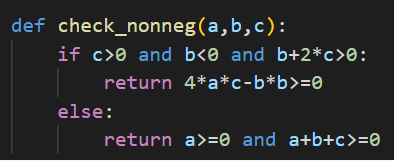
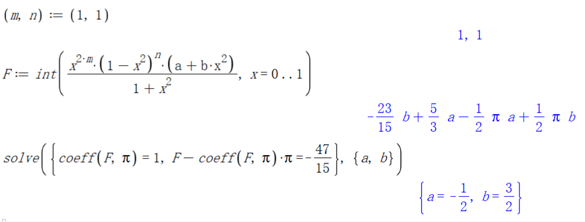
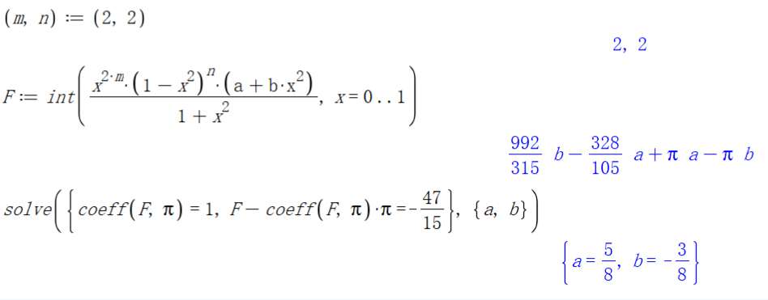

最近关于 $e$ 和 $\pi$ 的不等式问题突然火起来，多个问题“如何优雅地证明 $\pi>e$ ?”、“如何优雅地证明 $\pi^3>31$ ?”、“如何优雅地证明 $e^3>20$ ?”等频频登上知乎热榜。

论起优雅的证明方法少不了使用[定积分](https://zhida.zhihu.com/search?content_id=236860480&content_type=Article&match_order=1&q=%E5%AE%9A%E7%A7%AF%E5%88%86&zhida_source=entity)的证明。典型证明的套路就是谈笑间**“注意到”**一个关于 $e$ 或者 $\pi$ 的等于一个大于0的定积分，例如通过以下方法证明 $e^3>20$ ：

**注意到**

$\begin{align*}&e^3-20 = \frac{1}{8} \int_0^1x^3(1-x)^4(28+33x)e^{3x} dx > 0.\end{align*}$

**证毕！**

下面的评论基本都是“**注意力惊人**”、“**中国人自己的[拉马努金](https://zhida.zhihu.com/search?content_id=236860480&content_type=Article&match_order=1&q=%E6%8B%89%E9%A9%AC%E5%8A%AA%E9%87%91&zhida_source=entity)**”、“**Attention is all you need!**”等。

方法看起来非常的酷炫和优雅，但其实原理并不复杂。有些结果看起来非常“鬼畜”，但是借助软件来计算也不困难。本文来介绍具体的构造方法。

  

### 核心原理：

所有“注意到”的不等式的积分证明基于以下原理：

**要证明** $\color{blue}{u>v}$ **，首先找到一个** $[a,b]$ **（ 通常是** $[0,1]$ **）上的定积分，它的值恰好等于** $\color{blue}{u-v}$ **，且被积函数** $f(x)$ **在** $[a,b]$ **上恒非负（等于0的点只有有限个）, 然后通过**

$\begin{align*}\color{blue}{u-v=\int_a^b f(x) dx >0}\end{align*}$

**来证明。**

  

把答题过程流程化，以及将过去总结的答题技巧融入其中，让更多的人能够直接使用“注意力积分”的方法来解决问题，我制作的**注意力计算器**已发布，通过计算器可以直接找到**29种类型**的积分。

[【人人皆可优雅】注意力计算器自动生成积分证明(计算器地址: zhuyidao.com)](https://zhuanlan.zhihu.com/p/20960679909) 文章

### **计算器网址：**

[zhuyidao.com](https://link.zhihu.com/?target=http%3A//zhuyidao.com/)或者 [zhuyidao.net](https://link.zhihu.com/?target=http%3A//zhuyidao.net/)

  

### **注意力计算器.skill**

此外，已经把“注意力计算器”做成了skill，使用AI智能体助手，在对话框中直接生成积分证明。

[【优雅的智能体】注意力计算器.skill](https://zhuanlan.zhihu.com/p/2035023183380746326) 文章

  

文章主要分成两部分：第一部分介绍可以直接“注意到”的不等式（共45种类型），第二部分介绍构造积分的9个优雅技巧。

## **一. 可以直接“注意到”的不等式**

**π和e类**

-   **1）**$\pi$ **大于或小于一个有理数**
-   **2）**$e$ **大于或小于一个有理数**
-   **3）**$\pi^n$**(** $n$ **是整数 )大于或小于一个有理数**
-   **4）**$e^{q}$ **(** $q$ **是有理数 )大于或小于一个有理数**
-   **5）**$e^\pi$ **大于或小于一个有理数**
-   **6）**$e^{q\pi}$ **(** $q$ **是有理数 )大于或小于一个有理数**

**对数类**

-   **7)** $\ln q$ **(** $q$ **是有理数 )大于或小于一个有理数**
-   **8)** $(\ln q)^n$**(** $q$ **是有理数，**$n$ **是整数 )大于或小于一个有理数**
-   **9)** $\ln \pi$ **大于或小于一个有理数**

**反三角函数类**

-   **10)** $\arcsin q$ **(** $q$ **是有理数 )大于或小于一个有理数**
-   **11)** $\arccos q$ **(** $q$ **是有理数 )大于或小于一个有理数**
-   **12)** $\arctan q$ **(** $q$ **是有理数 )大于或小于一个有理数**
-   **13)** $\textrm{arccot }q$ **(** $q$ **是有理数 )大于或小于一个有理数**

**三角函数类**

-   **14)** $\sin q$ **(** $q$ **是有理数 )大于或小于一个有理数**
-   **15)** $\sin(\pi q)$ **或** $\sin(q^\circ)$ **(** $q$ **是有理数 )大于或小于一个有理数**
-   **16)** $\cos q$ **(** $q$ **是有理数 )大于或小于一个有理数**
-   **17)** $\cos(\pi q)$ **或** $\cos(q^\circ)$ **(** $q$ **是有理数 )大于或小于一个有理数**
-   **18)** $\tan q$ **(** $q$ **是有理数 )大于或小于一个有理数**
-   **19)** $\cot q$ **(** $q$ **是有理数 )大于或小于一个有理数**

**反双曲函数类**

-   **20)** $\text{arsinh }q$ **(** $q$ **是有理数 )大于或小于一个有理数**
-   **21)** $\text{arcosh }q$ **(** $q$ **是有理数 )大于或小于一个有理数**
-   **22)** $\text{artanh }q$ **(** $q$ **是有理数 )大于或小于一个有理数**
-   **23)** $\text{arcoth }q$ **(** $q$ **是有理数 )大于或小于一个有理数**

**双曲函数类**

-   **24)** $\sinh q$ **(** $q$ **是有理数 )大于或小于一个有理数**
-   **25)** $\cosh q$ **(** $q$ **是有理数 )大于或小于一个有理数**
-   **26)** $\tanh q$ **(** $q$ **是有理数 )大于或小于一个有理数**
-   **27)** $\coth q$ **(** $q$ **是有理数 )大于或小于一个有理数**

**指数和三角函数组合类**

-   **28)** $e^{q_1}\sin q_2$ **(** $q_1,q_2$ **都是有理数 )大于或小于一个有理数**
-   **29)** $e^{q_1}\cos q_2$ **(** $q_1,q_2$ **都是有理数 )大于或小于一个有理数**

**有理数类**

-   **30)** ${q_1}^{q_2}$ **(** $q_1,q_2$ **都是有理数 )大于或小于一个有理数**

**特殊常数类**

-   **31) [卡塔兰常数](https://zhida.zhihu.com/search?content_id=236860480&content_type=Article&match_order=1&q=%E5%8D%A1%E5%A1%94%E5%85%B0%E5%B8%B8%E6%95%B0&zhida_source=entity)** $C$ **大于或小于一个有理数**
-   **32) [欧拉常数](https://zhida.zhihu.com/search?content_id=236860480&content_type=Article&match_order=1&q=%E6%AC%A7%E6%8B%89%E5%B8%B8%E6%95%B0&zhida_source=entity)** $\gamma$ **大于或小于一个有理数**
-   **33) [黄金分割率](https://zhida.zhihu.com/search?content_id=236860480&content_type=Article&match_order=1&q=%E9%BB%84%E9%87%91%E5%88%86%E5%89%B2%E7%8E%87&zhida_source=entity)** $\phi$ **大于或小于一个有理数**
-   **34) 葛莱佘-金可林常数对数** $\ln A$ **大于或小于一个有理数**
-   **35) 双纽线周率** $\varpi$ **大于或小于一个有理数**
-   **36) 高斯常数** $G$ **大于或小于一个有理数**
-   **37)** $\Gamma(1/2),\ \Gamma(1/4),\ \Gamma(3/4)$ **大于或小于一个有理数**
-   **38)** $\Gamma(1/3),\ \Gamma(2/3)$ **大于或小于一个有理数**
-   **39)** $\psi'(1/2), \psi'(1/4), \psi'(3/4),$ $\psi'(1/3), \psi'(2/3)$ **大于或小于一个有理数**

**特殊函数类**

-   **40) [黎曼Zeta函数](https://zhida.zhihu.com/search?content_id=236860480&content_type=Article&match_order=1&q=%E9%BB%8E%E6%9B%BCZeta%E5%87%BD%E6%95%B0&zhida_source=entity)** $\zeta(s)$ **(** $s$ **为大于1的正整数）大于或小于一个有理数**
-   **41) [正弦积分函数](https://zhida.zhihu.com/search?content_id=236860480&content_type=Article&match_order=1&q=%E6%AD%A3%E5%BC%A6%E7%A7%AF%E5%88%86%E5%87%BD%E6%95%B0&zhida_source=entity)** $\textrm{Si}(q)$ **(** $q$ **是有理数 )大于或小于一个有理数**
-   **42) [指数积分函数](https://zhida.zhihu.com/search?content_id=236860480&content_type=Article&match_order=1&q=%E6%8C%87%E6%95%B0%E7%A7%AF%E5%88%86%E5%87%BD%E6%95%B0&zhida_source=entity)** $\textrm{Cin}(q)$ **和** $\textrm{Ci}(q)$ **(** $q$ **是有理数 )大于或小于一个有理数**
-   **43) 指数积分函数** $\textrm{Ein}(q)$,$E_1(q)$**和** $\textrm{Ei}(q)$ **(** $q$ **是有理数 )大于或小于一个有理数**
-   **44) 二重对数函数** $\textrm{Li}_2(q)$ **(** $q$ **是有理数 )大于或小于一个有理数**
-   **45) [误差函数](https://zhida.zhihu.com/search?content_id=236860480&content_type=Article&match_order=1&q=%E8%AF%AF%E5%B7%AE%E5%87%BD%E6%95%B0&zhida_source=entity)** $\textrm{erf}(q)$ **(** $q$ **是有理数 )大于或小于一个有理数**

  

以下逐一详细介绍每种类型的“注意力”原理。

### **第1种类型：** $\pi$ **大于或小于一个有理数**

我们使用形如 $\color{blue}{\begin{align*}\int_0^1 \frac{x^n(1-x)^n(a+bx+cx^2)}{1+x^2} dx \end{align*}}$ 的定积分，两个系数 $n$ 可以不相同， $n$ 值越大得到的不等式越紧。要注意最终生成的 $a+bx+cx^2$ 需要满足在 $[0,1]$ 上恒非负。

具体如何来确定指数 $n$ 和系数 $a,b,c$ 呢？我们首先列出 $n=1,2,3,4$ 的情况：

$\begin{align*} \int_0^1 \frac{x(1-x)(a+bx+cx^2)}{1+x^2} dx=&\  \frac{1}{4}(a-b-c)\pi + \frac{1}{2} (a +b -c)\ln2+\left(-a + \frac{1}{2} b + \frac{7}{6}c\right) \\ \int_0^1 \frac{x^2(1-x)^2(a+bx+cx^2)}{1+x^2} dx=&\   - \frac{b}{2}\pi + (a-c)\ln2 +\left(- \frac{2}{3}a + \frac{19}{12}b+ \frac{7}{10}c \right) \\ \int_0^1 \frac{x^3(1-x)^3(a+bx+cx^2)}{1+x^2} dx=&\   \frac{1}{2}(-a-b+c)\pi   + (a-b-c)\ln2 +\left(\frac{53}{60}a+\frac{34}{15}b- \frac{92}{105}c\right) \\ \int_0^1 \frac{x^4(1-x)^4(a+bx+cx^2)}{1+x^2} dx=&\ (-a+c)\pi - 2b\ln2 +\left(\frac{22}{7}a  + \frac{233}{168}b -\frac{1979}{630}c\right) \end{align*}$

每一种情况都是 $\pi, \ln2, 1$ 的有理线性组合，我们只要根据目标不等式带入系数，形成关于 $a,b,c$ 的三元一次方程组，手算或者使用软件确定 $a,b,c$ 的值即可（我喜欢使用 $a+bx+cx^2$ 的原因是恰好是有三个待定系数）。先从小的 $n$ 开始试验，看最终得到的 $a+bx+cx^2$ 是否在 $[0,1]$ 上恒非负，如果否就要提高 $n$ 的值直至满足恒非负的条件。

例如：在这个问题中需要证明 $8\pi>25.$

[https://www.zhihu.com/question/427526890/answer/3299759624](https://www.zhihu.com/question/427526890/answer/3299759624)

我们使用 $n=2$ 的情况，要凑出来 $8\pi-25$ 即

$\begin{align*}&\int_0^1 \frac{x^2(1-x)^2(a+bx+cx^2)}{1+x^2} dx\\ =&\   - \frac{b}{2}\pi + (a-c)\ln2+\left(- \frac{2}{3}a + \frac{19}{12}b+ \frac{7}{10}c \right)=8\pi-25.\end{align*}$

比较 $\pi$ 、 $\ln 2$ 和常数项的系数得到如下三元一次方程组：

$\left\{\begin{array}{l} - \dfrac{b}{2}=8\\ a-c=0 \\ - \dfrac{2}{3}a + \dfrac{19}{12}b+ \dfrac{7}{10}c=-25 \end{array}\right.$

解出 $a=c=10,\ b=-16,$ 得到的 $10-16x+10x^2$ 满足在 $[0,1]$ 上恒非负。于是

$\begin{align*}&8\pi - 25  = \int_0^1 \frac{x^2(1-x)^2(10-16x+10x^2)}{1+x^2} dx > 0.\end{align*}$

  

### **第2种类型：** $e$ **大于或小于一个有理数**

使用形如 $\color{blue}{\begin{align*}\int_0^1 x^n(1-x)^n(a+bx)e^{x} dx \end{align*}}$ 的定积分，这里两个系数 $n$ 可以不相同。

同样要注意最终生成的 $a+bx$ 需要满足在 $[0,1]$ 上恒非负，即满足 $a\ge 0, a+b\ge 0.$

列出 $n=1,2,3$ 的情况

$\begin{align*} \int_0^1x(1-x)(a+bx)e^x dx=&\ (-a+3b)e+(3a-8b)\\ \int_0^1x^2(1-x)^2(a+bx)e^x dx=&\ 2(7a-32b)e+2(-19a+87b)\\ \int_0^1x^3(1-x)^3(a+bx)e^x dx=&\ 6(-71a+465b)e+6(193a-1264b)\end{align*}$

每一种情况都是 $e, 1$的有理线性组合，待定系数即可确定。

例如：还是这个问题中我们需要证明 $9e<25.$

[https://www.zhihu.com/question/427526890/answer/3299759624](https://www.zhihu.com/question/427526890/answer/3299759624)

我们使用 $n=1$ 的情况，要凑出来 $25-9e$ 即

$\begin{align*}\int_0^1x(1-x)(a+bx)e^x dx=(-a+3b)e+(3a-8b)=25-9e\end{align*}$

则系数需要满足

$\left\{\begin{array}{l}  -a+3b=-9\\  3a-8b=25 \end{array}\right.$

解出 $a=3, b=-2$ ，得到的 $3-2x$ 满足在 $[0,1]$ 上恒非负。于是

$\begin{align*}&25-9e  =\int_0^1 x(1-x)(3-2x)e^x dx > 0.\end{align*}$

  

### **第3种类型：**$\pi^n$**(** $n$ **是整数 )大于或小于一个有理数**

我们仅需要考虑 $n$ 是正整数的情况，这是因为对于负整数 $n$ , $\pi^n$ 大于（或小于）一个正有理数 $q$ 等价于 $\pi^{-n}$ 小于（或大于） $1/q.$ 在关于 $\pi$ 的积分式基础上加入 $\ln^{n-1}(1/x)$ 这一项， 使用形如 $\color{blue}{\begin{align*}\int_0^1 \frac{x^m (a+bx^2)\ln^{n-1}(1/x)}{1+x^2} dx \end{align*}}$的定积分（其中 $m+n$ 要求为奇数，否则没有简洁结果）。

这里要注意：如果使用 $\ln x$ 而不是 $\ln(1/x)$ 需要注意最后积分式的正负号。为了防止忘记这一点，建议直接使用 $\ln(1/x)$，此外要保证最终生成的 $a+bx^2$ 需要满足在 $[0,1]$ 上恒非负（即满足 $a\ge 0,\ a+b\ge 0$ ）。

列出 $n=2,3,4,5,\ m=0,1,2,3, m+n$ 为奇数的情况如下：

$\begin{align*} \int_0^1\frac{x(a+bx^2)\ln(1/x)}{1+x^2}dx=&\ \frac{1}{48}(a-b)\pi^2+\frac{1}{4}b\\ \int_0^1\frac{x^3(a+bx^2)\ln(1/x)}{1+x^2}dx=&\ \frac{1}{48}(-a+b)\pi^2+\left(\frac{1}{4}a-\frac{3}{16}b\right)\\ \int_0^1\frac{(a+bx^2)\ln^2(1/x)}{1+x^2}dx=&\ \frac{1}{16}(a-b)\pi^3+2b\\ \int_0^1\frac{x^2(a+bx^2)\ln^2(1/x)}{1+x^2}dx=&\ \frac{1}{16}(-a+b)\pi^3+\left(2a-\frac{52}{27}b\right)\\ \int_0^1\frac{x(a+bx^2)\ln^3(1/x)}{1+x^2}dx=&\ \frac{7}{1920}(a-b)\pi^4+\frac{3}{8}b\\ \int_0^1\frac{x^3(a+bx^2)\ln^3(1/x)}{1+x^2}dx=&\ \frac{7}{1920}(-a+b)\pi^4+\left(\frac{3}{8}a-\frac{45}{128}b\right)\\ \int_0^1\frac{(a+bx^2)\ln^4(1/x)}{1+x^2}dx=&\ \frac{5}{64}(a-b)\pi^5+24b\\ \int_0^1\frac{x^2(a+bx^2)\ln^4(1/x)}{1+x^2}dx=&\ \frac{5}{64}(-a+b)\pi^5+\left(24a-\frac{1936}{81}b\right)\end{align*}$

每一种情况都是 $\pi^n, 1$的有理线性组合。

例如：我们需要证明 $\pi^3>31.$

[https://www.zhihu.com/question/624099087/answer/3270401325](https://www.zhihu.com/question/624099087/answer/3270401325)

使用 $n=3,\ m=12$ 的情况，

$\begin{align*}\int_0^1 \frac{x^{12} (a + b x^2) \ln^2(1/x)}{1 + x^2} dx = \frac{1}{16}(a-b)\pi^3+\left(-\frac{80596213364}{41601569625}a + \frac{177153083899958}{91398648466125} b\right) \end{align*}$

代入系数解如下二元一次方程组

$\left\{\begin{array}{l}\dfrac{1}{16}(a-b)=1\\  -\dfrac{80596213364}{41601569625}a + \dfrac{177153083899958}{91398648466125}b =-31\end{array}\right.$

得到

$\begin{align*} a = \frac{1091239949453}{83203139250},\ b= -\frac{240010278547}{83203139250}, \end{align*}$ 满足 $a+bx$ 在 $[0,1]$ 上恒非负。

因此 $\begin{align*}\pi^3-31 = \int_0^1 \frac{x^{12} (1091239949453-240010278547 x^2) \ln^2(1/x)}{83203139250(1 + x^2)} dx >0. \end{align*}$  

这里由于约束 $x\to 0$ 的 $x^{12}$ 和约束 $x\to 1$ 的 $\ln^2(1/x)$ 系数相差大不够平衡，可以通过增加 $(1-x^2)^k$ 这类项平衡两侧收敛速度，即使用形如$\color{blue}{\begin{align*}\int_0^1 \frac{x^m(1-x^2)^k (a+bx^2)\ln^{n-1}(1/x)}{1+x^2} dx \end{align*}}$的定积分（其中 $m+n$ 要求为奇数）。

  

### **第4种类型：** $e^{q}$ **(** $q$ **是有理数 )大于或小于一个有理数**

在关于 $e$ 的积分式中把 $e^x$ 变成 $e^{qx}$ ， 使用形如 $\color{blue}{\begin{align*}\int_0^1 x^n(1-x)^n(a+bx)e^{qx} dx \end{align*}}$ 的定积分，其中两个系数 $n$ 可以不相同。同样要注意最终生成的 $a+bx$ 需要满足在 $[0,1]$ 上恒非负，即满足 $a\ge 0, a+b\ge 0.$

随着有理数 $q$ 的分子分母的增大，最终出现的数字可能非常的巨大，这里列出 $n=1$ 的情况：

$\begin{align*} &\int_0^1x(1-x)(a+bx)e^{qx} dx\\ &\quad = \frac{1}{q^4}((a+b)q^2+(-2a-4b)q+6b)e^q+\frac{1}{q^4}(aq^2+2(a-b)q-6b). \end{align*}$

对于每一个 $n$ ，定积分的结果都是 $e^q, 1$的有理线性组合。

例如：我们要证明 $e^3>20.$

[https://www.zhihu.com/question/613154710/answer/3302422608](https://www.zhihu.com/question/613154710/answer/3302422608)

待定系数后得到

$\begin{align*}&e^3-20 = \frac{1}{8} \int_0^1x^3(1-x)^4(28+33x)e^{3x} dx > 0.\end{align*}$  
  

### **第5种类型：关于** $e^\pi$ **大于或小于一个有理数**

由于 $\pi$ 不是有理数，这里类比 $e$ 用形如 $\color{blue}{\begin{align*}\int_0^\pi \sin^nx(1-\sin x)^n(a+b\sin x)e^{x} dx \end{align*}}$ 的积分式，两个系数 $n$ 可以不相同。同样注意最终生成的 $a+b\sin x$ 需要满足在 $[0,\pi]$ 上恒非负，即满足 $a\ge 0, a+b\ge 0.$

列出 $n=1,2$ 的情况

$\begin{align*} &\int_0^\pi\sin x(1-\sin x)(a+b\sin x)e^x dx\\ &\quad = \left(\frac{1}{10}a+\frac{1}{10}b\right)e^\pi+\left(\frac{9}{10}a-\frac{7}{10}b\right)\\ &\int_0^\pi\sin^2x(1-\sin x)^2(a+b\sin x)e^x dx\\ &\quad = \left(\frac{7}{85}a-\frac{15}{442}b\right)e^\pi+\left(-\frac{109}{85}a+\frac{2421}{2210}b\right) \end{align*}$

每一种情况都是 $e^\pi, 1$的有理线性组合。

例如：下面这个问题需要证明 $e^\pi>22,$

[https://www.zhihu.com/question/643379125/answer/3390052008](https://www.zhihu.com/question/643379125/answer/3390052008)

我们使用 $n=3$ 的情况，经过计算系数得到  
$\begin{align*}&e^\pi-22 =\dfrac{5}{11184}\int_0^\pi e^x\sin^3{x}(1-\sin x)^3 (3984+30965\sin x) dx> 0.\end{align*}$

  

### **第6种类型：**$e^{q\pi}$ **(** $q$ **是有理数 )大于或小于一个有理数**

这里类比 $e^\pi$ 的积分式，我们使用形如 $\color{blue}{\begin{align*}\int_0^\pi \sin^nx(1-\sin x)^n(a+b\sin x)e^{qx} dx \end{align*}},$ 两个系数 $n$ 可以不相同。同样注意最终生成的 $a+b\sin x$ 需要满足在 $[0,\pi]$ 上恒非负，即满足 $a\ge 0, a+b\ge 0.$

列出 $n=1$ 的情况

$\begin{align*} &\int_0^\pi\sin x(1-\sin x)(a+b\sin x)e^{qx} dx\\ &\quad =\frac{1}{q(q^6+14q^4+49q^2+36)}((aq^5+(-2a+2b)q^4+(13a-6b)q^3+(-20a+20b)q^2+(36a-24b)q+(-18a+18b))e^{q\pi}+((aq^5+(2a-2b)q^4+(13a-6b)q^3+(20a-20b)q^2+(36a-24b)q+(18a-18b)))\end{align*}$

每一种情况都是 $e^{q\pi}, 1$的有理线性组合。

例如：证明 $e^{3\pi/4}>\dfrac{21}{2}.$ 我们使用前一个 $n=3$ 后一个 $n=4$ 的情况，计算系数得到 $\begin{align*}&e^{3\pi/4}-\dfrac{21}{2} =\dfrac{13}{76404129792}\int_0^\pi e^{3x/4}\sin^3{x}(1-\sin x)^4 (1888358000+14100605983\sin x) dx> 0.\end{align*}$

  

### **第7种类型：** $\ln q$ **(** $q$ **是有理数 )大于或小于一个有理数**

本质上和“ $e^q$( $q$ 是有理数 )大于或小于一个有理数”是对偶的（因为对于两个有理数 $p,q>0$，不等式 $\ln q>(\textrm{or }<)\ p$ 等价于不等式 $e^p<(\textrm{or }>)\ q$ ），我们可以使用积分直接凑出来 $\ln q$ 的形式。这里只需要考虑 $q>1$ 的情况，因为对于 $0<q<1$ 使用 $\ln(1/q)=-\ln q$ 即可。

我们使用形如$\color{blue}{\begin{align*}\int_0^1 \frac{x^n(1-x)^n(a+bx)}{1+(q-1)x} dx\end{align*}}$的定积分，其中两个系数 $n$ 可以不相同。

随着有理数 $q$ 的分子分母的增大，最终出现的数字可能非常的巨大，这里列出 $n=1$ 的情况：

$\begin{align*}\int_0^1 \frac{x(1-x)(a+bx)}{1+(q-1)x} dx =\frac{6}{(q-1)^4}(6q(-qa+a+b)\ln q+(3a+b)q^3+(-3a-6b)q^2+(-3a+3b)q+(3a+2b)). \end{align*}$

对于每一个 $n$ ，定积分的结果都是 $\ln q, 1$的有理线性组合。这里积分的分母可以替换为高次方 $(1+(q-1)x)^m$ （ $m$ 为正整数），会增加收敛的速度。

例如：我们要证明 $\ln 3<\dfrac{10}{9}$ ，使用 $n=3$ 的情况，待定系数后得到

$\begin{align*}&\frac{10}{9}-\ln 3 = \int_0^1 \frac{8x^3(1-x)^3(41-14x)}{81(1+2x)} dx > 0.\end{align*}$

而如果反过来证明 $e^{10/9}>3$ 则是通过

$\begin{align*}&e^{10/9}-3 = \int_0^1\dfrac{80x^3(1-x)^3(672+115x)e^{10x/9}}{19683}  dx > 0.\end{align*}$  
由于指数的分子分母更大，于是结果用到的数字也更大。

  

### **第8种类型：** $(\ln q)^n$**(** $q$ **是有理数，**$n$ **是整数 )大于或小于一个有理数**

这里只需要考虑 $q>1, n$ 是正整数的情况，因为对于 $0<q<1$ 使用 $(\ln q)^n=(-1)^n\ln^n (1/q)$ ，对于 $n$ 是负整数， $(\ln q)^n=1/\ln^{-n}(q)$ 。

我们使用形如 $\color{blue}{\begin{align*}\int_0^1 x^m(1-x)^m(a_0+a_1x+\cdots+a_nx^n)\dfrac{\ln^{n-1}(1+(q-1)x)}{1+(q-1)x} dx \end{align*}}$ 的定积分，其中两个系数 $m$ 可以不相同，这里要保证 $a_0+a_1x+\cdots+a_nx^n$ 在 $[0,1]$ 恒非负。

随着有理数 $q$ 的分子分母以及 $n$ 增大，最终出现的数字可能非常的巨大。对于每一个 $n$ ，定积分的结果是 $1, \ln q, \ldots, (\ln q)^n$的有理线性组合，这时候我们正好有 $n+1$ 个待定系数 $a_0,a_1,\ldots,a_n,$

然后使得 $\ln q, (\ln q)^2,\ldots, (\ln q)^{n-1}$ 系数为0，常数项和 $(\ln q)^n$ 凑出我们需要的不等式。

例如：我们在下面问题中需要证明 $(\ln 2)^2>\left(\dfrac{\sqrt{17}}{6}\right)^2$

[https://www.zhihu.com/question/595894272/answer/3340439842](https://www.zhihu.com/question/595894272/answer/3340439842)

使用 $m=3, n=2$ 的情况，待定系数后得到

$\begin{align*} (\ln 2)^2-\left(\frac{\sqrt{17}}{6}\right)^2=\int_0^1\dfrac{x^3(1-x)^3(365+22058x+20652x^2)\ln(1+x)}{4164(1+x)}dx>0. \end{align*}$

  

### **第9种类型：** $\ln \pi$ **大于或小于一个有理数**

我们使用形如$\color{blue}{\begin{align*}\int_0^1 \frac{x^n(1-x)^n(a+bx)}{(1+x)\ln(1/x)} dx\end{align*}}$的定积分，其中两个系数 $n$ 可以不相同。注意最终生成的 $a+bx$ 需要满足在 $[0,1]$ 上恒非负，即满足 $a\ge 0, a+b\ge 0.$

这里列出 $n=1,2$ 的情况：

$\begin{align*}\int_0^1\frac{x(1-x)(a+bx)}{(1+x)\ln(1/x)} dx&\ = (-a+b)\ln\pi+(2a-3b)\ln2+b\ln3\\ \int_0^1\frac{x^2(1-x)^2(a+bx)}{(1+x)\ln(1/x)} dx&\ = (2a-2b)\ln\pi+(-8a+12b)\ln2+(3a-4b)\ln3-b\ln5\\ \end{align*}$

对于每一个 $n$ ，定积分的结果都是 $\ln \pi, \ln q$ （ $q$ 是有理数）的有理线性组合。然后利用 $\ln q$ 的有理上下界就得到了 $\ln \pi$ 的有理上下界。

例如：我们要证明 $\ln \pi<\dfrac{6}{5}$ ，首先找到 $\ln 2$ 的上界 $\dfrac{61}{88}$ 和 $\ln 3$ 的下界 $\dfrac{469}{440}$ ：

$\begin{align*} \dfrac{61}{88}-\ln2=\int_0^1 \dfrac{x^4(1-x)^3}{44(1+x)^2}dx>0,\end{align*}$

$\begin{align*} \ln3-\dfrac{469}{440}=\int_0^1 \dfrac{x^2(1-x)^2(1065-686x)}{396(1+2x)}dx>0,\end{align*}$

然后使用 $n=1$ 的情况待定系数得到 $a=1/2,\ b=-1/2,$ 于是  
  
$\begin{align*}\int_0^1\frac{x(1-x)^2}{2(1+x)\ln(1/x)} dx&\ = -\ln\pi+\dfrac{5}{2}\ln2-\dfrac{1}{2}\ln3>0, \end{align*}$

因此

$\begin{align*}\ln\pi<\dfrac{5}{2}\ln2-\dfrac{1}{2}\ln3<\dfrac{5}{2}\times\dfrac{61}{88}-\dfrac{1}{2}\times\dfrac{469}{440}=\dfrac{6}{5}.\end{align*}$

如果写成一个式子即

$\begin{align*} \ln3-\dfrac{469}{440}=\int_0^1\dfrac{x^2(1-x)^2}{88}\left[ \dfrac{5x^2(1-x)}{(1+x)^2}+\dfrac{1065-686x}{9(1+2x)}\right]dx>0.\end{align*}$

  

### **第10种类型：** $\arcsin q$ **(** $q$ **是有理数 )大于或小于一个有理数**

这里只需考虑 $0<q<1,$ 因为对于 $-1<q<0$ 有 $\arcsin q=-\arcsin(-q).$ 我们使用形如 $\color{blue}{\begin{align*}\int_0^1 \frac{x^{n}(1-x)^{n}(a+bx+cx^2)}{\sqrt{1-(qx)^2}} dx \end{align*}}$ 的定积分，其中两个系数 $n$ 可以不相同。

随着有理数 $q$ 的分子分母的增大，最终出现的数字可能非常的巨大。随着有理数 $q$ 的分子分母的增大，最终出现的数字可能非常的巨大，这里列出 $n=1$ 的情况：

$\begin{align*}\int_0^1  \frac{x(1-x)(a+bx+cx^2)}{\sqrt{1-(qx)^2}} dx =\frac{1}{24q^5}(((-12a+12b)q^2-9c)\arcsin q+((-12a-4b-2c)q^3+(16b-7c)q)\sqrt{1-q^2}+24aq^3+(-16b+16c)q). \end{align*}$

对于每一个 $n$ ，定积分的结果为$\arcsin q$， $\sqrt{1-q^2}$ 和 $1$ 的有理线性组合。

例如：我们要证明 $\arcsin \dfrac{1}{3}<\dfrac{3}{5}$ ，使用 $n=1$ 的情况，待定系数后得到

$\begin{align*}&\frac{3}{5}-\arcsin \frac{1}{3} = \int_0^1 \frac{x(1-x)(1710+37x-236x^2)}{360\sqrt{9-x^2}} dx > 0.\end{align*}$

  

### **第11种类型：**$\arccos q$ **(** $q$ **是有理数 )大于或小于一个有理数**

我们有两种方法。第一种方法利用等式 $\arccos q =\dfrac{\pi}{2}-\arcsin q$ ，这样变成求 $\arcsin q$ 和 $\dfrac{\pi}{2}$ 的有理数界；

第二种也可以使用 $\arccos q = \arcsin \sqrt{1-q^2}$ 转而求 $\arcsin \sqrt{1-q^2}$ 的有理数界，我们使用形如 $\color{blue}{\begin{align*}\int_0^1 \frac{x^{n}(1-x)^{n}(a+bx+cx^2)}{\sqrt{1-(1-q^2)x^2}} dx \end{align*}}$ 的定积分，其中两个系数 $n$ 可以不相同。

随着有理数 $q$ 的分子分母的增大，最终出现的数字可能非常的巨大。随着有理数 $q$ 的分子分母的增大，最终出现的数字可能非常的巨大，这里列出 $n=1$ 的情况：

$\begin{align*}\int_0^1  \frac{x(1-x)(a+bx)}{\sqrt{1-(1-q^2)x^2}} dx =\dfrac{-a+b}{2 (1-q^2)^2}\sqrt{1-q^2}\arccos q+\frac{1}{6(1-q^2)^2}((3 a + b) q^3- 6 a q^2 + (-3 a + 3 b) q +(6 a - 4 b)). \end{align*}$

对于每一个 $n$ ，定积分的结果为$\sqrt{1-q^2}\arccos q$ 和 $1$ 的有理线性组合。

  

例如：我们要证明 $\arccos \dfrac{2}{3}<\dfrac{6}{7}$ ，第一种方法首先利用

$\begin{align*}\frac{22}{7}-\pi= \int_0^1 \frac{x^4(1-x)^4}{1+x^2} dx > 0\end{align*}$

和

$\begin{align*}&\arcsin \frac{2}{3} -\frac{5}{7}= \int_0^1 \dfrac{4x^3(1-x)^4(407682+479468x+130203x^2)}{212625\sqrt{9-4x^2}} dx > 0\end{align*}$

得到 $\pi$ 的上界 $\dfrac{22}{7}$ 和 $\arcsin\dfrac{2}{3}$ 的下界 $\dfrac{5}{7}$，于是

$\begin{align*}&\dfrac{6}{7}-\arccos \dfrac{2}{3} = \int_0^1 x^3(1-x)^4\left[\dfrac{x}{2(1+x^2)}+\dfrac{4(407682+479468x+130203x^2)}{212625\sqrt{9-4x^2}} \right] dx > 0.\end{align*}$

第二种方法待定系数得到

$\begin{align*}&\dfrac{6}{7}-\arccos \dfrac{2}{3} = \int_0^1 \dfrac{200x(1-x)^2}{2961\sqrt{9-5x^2}}\left(\dfrac{19639}{2349 + 1043\sqrt5}+\dfrac{32105(1-x)}{3(810 + 371\sqrt5)}\right) dx > 0.\end{align*}$

第一种方法的优点在于当 $\sqrt{1-q^2}$ 不为有理数时，最终的系数也不会带根号，形式相对简单一些。第二种方法的优点是只需要处理两个待定系数。

  

### **第12种类型：** $\arctan q$ **(** $q$ **是有理数 )大于或小于一个有理数**

在关于 $\pi$ 的积分式中把分母 $(1+x^2)$ 变成 $1+(qx)^2$ ， 使用形如 $\color{blue}{\begin{align*}\int_0^1 \frac{x^{2n}(1-x^2)^{n}(a+bx^2)}{1+(qx)^2} dx \end{align*}}$ 的定积分，其中两个系数 $n$ 可以不相同。这里注意到所有的 $x$ 的次数都是偶数，若式子中包含 $x$ 的奇数次项，最终会生成不需要的 $\ln(1+q^2)$ 这一项。同样要注意最终生成的 $a+bx^2$ 需要满足在 $[0,1]$ 上恒非负，即要求 $a\ge 0, \ a+b\ge 0.$

随着有理数 $q$ 的分子分母的增大，最终出现的数字可能非常的巨大，这里列出 $n=1$ 的情况：

$\begin{align*}\int_0^1 \frac{x^{2}(1-x^2)(a+bx^2)}{1+(qx)^2} dx =\frac{1}{15q^7}(15(-aq^4+(-a+b)q^2+b)\arctan q+(10a+2b)q^5+(15a-10b)q^3-15bq). \end{align*}$

对于每一个 $n$ ，定积分的结果都是 $\arctan q, 1$的有理线性组合。

例如：我们要证明 $\arctan 2< \dfrac{6}{5},$ 使用 $n=3$ 的情况待定系数后得到

$\begin{align*}&\dfrac{6}{5}-\arctan 2 =\int_0^1 \frac{x^6(1-x^2)^3(87917-41548x^2)}{1500(1+4x^2)}dx > 0.\end{align*}$

### **第13种类型：** $\textrm{arccot }q$ **(** $q$ **是有理数 )大于或小于一个有理数**

只要利用等式 $\textrm{arccot }q = \arctan \dfrac{1}{q}$ ，这样变成求 $\arctan \dfrac{1}{q}$ 有理数界即可。

例如我们要证明 $\textrm{arccot }\dfrac{1}{2}< \dfrac{6}{5},$ 只需要证明 $\textrm{arctan }2< \dfrac{6}{5},$ 于是使用 $n=3$ 的情况待定系数后得到

$\begin{align*}&\dfrac{6}{5}-\textrm{arccot }\dfrac{1}{2} = \dfrac{6}{5}-\arctan 2=\int_0^1 \frac{x^6(1-x^2)^3(87917-41548x^2)}{1500(1+4x^2)}dx > 0.\end{align*}$

  

### **第14种类型：** $\sin q$ **(** $q$ **是有理数 )大于或小于一个有理数**

本质上和“ $\arcsin q$ ( $q$ 是有理数 )大于或小于一个有理数”是对偶的（因为对于两个有理数 $0<p<1,\ 0<q<\pi/2,$ 不等式 $\sin q>(\textrm{or }<)\ p$ 等价于不等式 $\arcsin p<(\textrm{or }>)\ q$），我们可以使用积分直接凑出来 $\sin q$ 的形式。

我们使用形如 $\color{blue}{\begin{align*}\int_0^1 x^n(1-x)^n(a+bx+cx^2)\sin(qx) dx \end{align*}}$ 的定积分，其中两个系数 $n$ 可以不相同，用$\cos(qx)$ 替换 $\sin(qx)$ 也可以。同样要注意最终生成的 $a+bx+cx^2$ 需要满足在 $[0,1]$ 上恒非负。

随着有理数 $q$ 的分子分母的增大，最终出现的数字可能非常的巨大，这里列出 $n=1$ 的情况：

这里列出 $n=1$ 时的情况：

$\begin{align*}\int_0^1 x(1-x)(a+bx+cx^2)\sin(qx) dx  =\dfrac{-(a+b+c)q^3+(6b+18c)q}{q^5}\sin q\ + \dfrac{-(2a+4b+6c)q^2+24c}{q^5}\cos q\ + \dfrac{(-2a+2b)q^2+24c}{q^5} \end{align*}$

对于每一个 $n$ ，定积分的结果为$\sin q, \ \cos q,\ 1$ 的有理线性组合。

例如：我们要证明 $\sin\dfrac{3}{5}>\dfrac{1}{3},$ 我们可以像 $\arcsin$ 的情况一样证明 $\arcsin \dfrac{1}{3}<\dfrac{3}{5}$ ，也可以直接使用 $n=1$ 的情况，待定系数后得到

$\begin{align*}&\sin \dfrac{3}{5} -\dfrac{1}{3} =\dfrac{1}{750} \int_0^1 x(1-x)(3571-102x+111x^2)\sin\dfrac{3x}{5}dx > 0.\end{align*}$

  

### **第15种类型：** $\sin(\pi q)$ 或 $\sin(q^\circ)$ **(** $q$ **是有理数 )大于或小于一个有理数**

对于 $\sin(\pi q)$ 我们仅需要讨论 $0<q<1/2$ 的情况，因为其他情况都可以通过诱导公式转化为此类情况，而 $\sin(q^\circ)=\sin\left(\dfrac{q\pi}{180}\right)$ 属于同样的情况。我们使用形如 $\color{blue}{\begin{align*}\int_0^{\pi/2} \sin^n x(1-\sin x)^n(a+b\sin x)\sin((1-2q)x) dx \end{align*}}$ 的定积分，其中两个系数 $n$ 可以不相同。同样要注意最终生成的 $a+b\sin x$ 需要满足在 $[0,1]$ 上恒非负，即 $a\ge 0,\ a+b\ge 0.$

随着有理数 $q$ 的分子分母的增大，最终出现的数字可能非常的巨大，这里列出 $n=1$ 的情况：

$\begin{align}\int_0^{\pi/2} \sin x(1-\sin x)(a+b\sin x)\sin((1-2q)x) dx  =\dfrac{1}{8q(8q^6-28q^5+14q^4+35q^3-28q^2-7q+6)}\left[((-8a-8b)q^4+(16a+16b)q^3+(2a-10b)q^2+(-10a+2b)q+12a-9b)\sin(\pi q)+((16b-16a)q^4+(-32b+32a)q^3+(16a-16b)q^2+(32b-32a)q)\right]\end{align}$

对于每一个 $n$ ，定积分的结果为 $\sin(\pi q),\ 1$ 的有理线性组合。

我们要证明 $\sin\dfrac{\pi}{7}<\dfrac{4}{9},$ 我们使用 $n=2$ 的情况待定系数后得到

$\begin{align*}&\dfrac{4}{9} - \sin \dfrac{\pi}{7} = \frac{10}{7512729}\int_0^{\pi/2}  \sin^2 x(1-\sin x)^2(382249+169240\sin x)\sin\!\left(\dfrac{5x}{7}\right)dx > 0.\end{align*}$

  

### **第16种类型：** $\cos q$ **(** $q$ **是有理数 )大于或小于一个有理数**

和 $\sin q$ 的情况类似，我们同样使用形如 $\color{blue}{\begin{align*}\int_0^1 x^n(1-x)^n(a+bx+cx^2)\sin(qx) dx \end{align*}}$ 的定积分，其中两个系数 $n$ 可以不相同，用$\cos(qx)$ 替换 $\sin(qx)$ 也可以。同样要注意最终生成的 $a+bx+cx^2$ 需要满足在 $[0,1]$ 上恒非负。

对于每一个 $n$ ，定积分的结果为$\sin q, \ \cos q,\ 1$ 的有理线性组合，最后待定系数即可。

例如：在下面这个问题中的中间步骤需要证明 $\begin{align*}\cos 1 < \dfrac{6}{11}\end{align*}$

[https://www.zhihu.com/question/665996323/answer/39584485197](https://www.zhihu.com/question/665996323/answer/39584485197)

待定系数得到

$\begin{align*}\dfrac{6}{11}-\cos 1=\int_0^1 \dfrac{(1-x)^2(2(1-x)+x^2)\sin x}{22}dx>0.\end{align*}$

  

### **第17种类型：** $\cos(πq)$ 或 $\cos(q^\circ)$ **(** $q$ **是有理数 )大于或小于一个有理数**

对于 $\cos(\pi q)$ 我们仅需要讨论 $0<q<1/2$ 的情况，因为其他情况都可以通过诱导公式转化为此类情况。而 $\cos(q^\circ)=\cos\left(\dfrac{q\pi}{180}\right)$ 属于同样的情况。这里我们进需要讨论 $0<q<1/2$ 的情况，因为其他情况都可以通过诱导公式转化为此类情况。我们使用形如 $\color{blue}{\begin{align*}\int_0^{\pi/2} \sin^n x(1-\sin x)^n(a+b\sin x)\sin(2qx) dx \end{align*}}$ 的定积分，其中两个系数 $n$ 可以不相同。同样要注意最终生成的 $a+b\sin x$ 需要满足在 $[0,1]$ 上恒非负，即 $a\ge 0,\ a+b\ge 0.$

随着有理数 $q$ 的分子分母的增大，最终出现的数字可能非常的巨大，这里列出 $n=1$ 的情况：

$\begin{align}\int_0^{\pi/2} \sin x(1-\sin x)(a+b\sin x)\sin(2qx) dx  =\dfrac{1}{4q(16q^6-56q^4+49q^2-9)}\left[((8a+8b)q^4+(-14a-2b)q^2+(-9a+9b))\cos(\pi q)+((16a-16b)q^4+(-40a+40b)q^2+(9a-9b))\right]\end{align}$

对于每一个 $n$ ，定积分的结果为 $\cos(\pi q),\ 1$ 的有理线性组合。

我们要证明 $\cos 40^\circ>\dfrac{3}{4},$ 我们使用 $n=1$ 的情况，待定系数后得到

$\begin{align*}&\cos 40^\circ -\dfrac{3}{4}= \frac{7}{23328}\int_0^{\pi/2}  \sin x\sin(4x/9)(1-\sin x)(1399-713\sin x)dx > 0.\end{align*}$  

### **第18种类型：** $\tan q$ **(** $q$ **是有理数 )大于或小于一个有理数**

本质上和第十种类型“ $\arctan q$ ( $q$ 是有理数 )大于或小于一个有理数”是对偶的（因为对于两个有理数 $p>0,\ 0<q<\pi/2,$ 不等式 $\tan q>(\textrm{or }<)\ p$ 等价于不等式 $\arctan p<(\textrm{or }>)\ q$），我们可以使用积分直接凑出来 $\tan q$ 的形式。我们可以将 $\tan q>p$ 问题转化为 $\sin q-p\cos q>(\textrm{or }<)0$ , 这样我们依然使用形如 $\color{blue}{\begin{align*}\int_0^1 x^n(1-x)^n(a+bx+cx^2)\sin(qx) dx \end{align*}}$ 的定积分，其中两个系数 $n$ 可以不相同，要注意最终生成的 $a+bx+cx^2$ 需要满足在 $[0,1]$ 上恒非负。对于每一个 $n$ ，定积分的结果都是 $\sin q, \ \cos q,\ 1$ 的有理线性组合。最后在不等式左右同时除以 $\cos q$ 即可。

例如：我们要证明 $\tan\dfrac{6}{5}>2,$ 我们可以使用反函数证明 $\arctan 2<\dfrac{6}{5}$ ，也可以直接使用 $n=1$ 的情况，待定系数后得到

$\begin{align*}&\tan \dfrac{6}{5} - 2 = \int_0^1 \frac{8x(1-x)(31+6x+3x^2)\sin(6x/5)}{125\cos(6/5)} dx > 0.\end{align*}$

  

### **第19种类型：** $\cot q$ **(** $q$ **是有理数 )大于或小于一个有理数**

只要利用等式 $\cot q = \dfrac{1}{\tan q}$ ，这样变成求 $\tan q$ 的有理数界即可。

例如我们要证明 $\cot\dfrac{6}{5}<\dfrac{1}{2},$ 我们只需要证明 $\tan\dfrac{6}{5}>2$ ，于是直接使用 $n=1$ 的情况，待定系数后两边同时除以 $2\tan\dfrac{6}{5}$ 得到

$\begin{align*}&\dfrac{1}{2}-\cot \dfrac{6}{5} = \int_0^1 \frac{4x(1-x)(31+6x+3x^2)\sin(6x/5)}{125\sin(6/5)} dx > 0.\end{align*}$

  

### **第20种类型：** $\text{arsinh }q$ **(** $q$ **是有理数 )大于或小于一个有理数**

反双曲正弦函数 $\text{arsinh } q=\ln(q+\sqrt{q^2+1})$ ，这里只需考虑 $q>0,$ 因为对于 $q<0$ 有 $\text{arsinh }q=-\text{arsinh}(-q).$ 我们使用形如 $\color{blue}{\begin{align*}\int_0^1 \frac{x^{n}(1-x)^{n}(a+bx+cx^2)}{\sqrt{1+(qx)^2}} dx \end{align*}}$ 的定积分，其中两个系数 $n$ 可以不相同。要注意最终生成的 $a+bx+cx^2$ 需要满足在 $[0,1]$ 上恒非负。

随着有理数 $q$ 的分子分母的增大，最终出现的数字可能非常的巨大。随着有理数 $q$ 的分子分母的增大，最终出现的数字可能非常的巨大，这里列出 $n=1$ 的情况：

$\begin{align*}\int_0^1  \frac{x(1-x)(a+bx+cx^2)}{\sqrt{1+(qx)^2}} dx =\frac{1}{24q^5}(((12a-12b)q^2-9c)\text{arsinh }q+((12a+4b+2c)q^3+(16b-7c)q)\sqrt{1+q^2}-24aq^3+(-16b+16c)q). \end{align*}$

对于每一个 $n$ ，定积分的结果为$\text{arsinh }q$， $\sqrt{1+q^2}$ 和 $1$ 的有理线性组合。

例如：我们要证明 $\text{arsinh }\dfrac{1}{3}>\dfrac{3}{10}$ ，使用 $n=1$ 的情况，待定系数后得到

$\begin{align*}&\text{arsinh }\frac{1}{3}-\frac{3}{10}= \int_0^1 \frac{x(1-x)(45-2x+4x^2)}{90\sqrt{9+x^2}} dx > 0.\end{align*}$

  

### **第21种类型：** $\text{arcosh }q$ **(** $q$ **是有理数 )大于或小于一个有理数**

反双曲余弦函数 $\text{arcosh } q=\ln(q+\sqrt{q^2-1})$ ，这里考虑 $q>1,$ 注意到 $\text{arcosh}(q)=\text{arsinh}(\sqrt{q^2-1})$ ，因此我们使用形如 $\color{blue}{\begin{align*}\int_0^1 \frac{x^{n}(1-x)^{n}(a+bx)}{\sqrt{1+(q^2-1)x^2}} dx \end{align*}}$ 的定积分，其中两个系数 $n$ 可以不相同。同样要注意最终生成的 $a+bx$ 需要满足在 $[0,1]$ 上恒非负，即 $a\ge 0,\ a+b\ge 0.$

随着有理数 $q$ 的分子分母的增大，最终出现的数字可能非常的巨大。随着有理数 $q$ 的分子分母的增大，最终出现的数字可能非常的巨大。

  

对于每一个 $n$ ，定积分的结果为$\sqrt{q^2-1}\text{arcosh }q$ 和 $1$ 的有理线性组合。

例如：我们要证明 $\text{arcosh}\dfrac{3}{2}>\dfrac{4}{5}$ ，使用 $n=1$ 的情况，待定系数后得到

$\begin{align*}&\text{arcosh}\dfrac{3}{2}-\dfrac{4}{5}= \int_0^1 \frac{5x(1-x)}{16\sqrt{4+5x^2}}\left(\dfrac{341}{48+23\sqrt5}+\dfrac{393(1-x)}{2(16+5\sqrt5)}\right) dx > 0.\end{align*}$

  

### **第22种类型：** $\text{artanh }q$ **(** $q$ **是有理数 )大于或小于一个有理数**

反双曲正切函数 $\text{artanh } q=\dfrac{1}{2}\ln\dfrac{1+q}{1-q} \ (-1<q<1)$ ，由于 $\tilde{q}:=\dfrac{1+q}{1-q}$ 也是一个有理数，于是转化为求 $\ln \tilde{q}$ 的有理数界，利用$\color{blue}{\begin{align*}\int_0^1 \frac{x^n(1-x)^n(a+bx)}{1+(\tilde{q}-1)x} dx\end{align*}}$的定积分，其中两个系数 $n$ 可以不相同。

随着有理数定积分即可。

例如：我们要证明 $\text{artanh}\dfrac{1}{2}<\dfrac{5}{9}$ ，转化为证明 $\ln 3<\dfrac{10}{9},$ 于是

$\begin{align*}&\dfrac{5}{9}-\text{artanh}\dfrac{1}{2}=\dfrac{1}{2}\left(\frac{10}{9}-\ln 3 \right)= \int_0^1 \frac{4x^3(1-x)^3(41-14x)}{81(1+2x)} dx > 0.\end{align*}$

  

### **第23种类型：** $\text{arcoth }q$ **(** $q$ **是有理数 )大于或小于一个有理数**

反双曲余切函数 $\text{arcoth } q=\dfrac{1}{2}\ln\dfrac{q+1}{q-1} \ (q>1)$ ，由于 $\tilde{q}:=\dfrac{q+1}{q-1}$ 也是一个有理数，于是转化为求 $\ln \tilde{q}$ 的有理数界，利用$\color{blue}{\begin{align*}\int_0^1 \frac{x^n(1-x)^n(a+bx)}{1+(\tilde{q}-1)x} dx\end{align*}}$的定积分，其中两个系数 $n$ 可以不相同。

随着有理数定积分即可。

例如：我们要证明 $\text{arcoth}(2)<\dfrac{5}{9}$ ，转化为证明 $\ln 3<\dfrac{10}{9},$ 于是

$\begin{align*}&\dfrac{5}{9}-\text{arcoth}(2)=\dfrac{1}{2}\left(\frac{10}{9}-\ln 3 \right)= \int_0^1 \frac{4x^3(1-x)^3(41-14x)}{81(1+2x)} dx > 0.\end{align*}$

  

### **第24种类型：** $\sinh q$ **(** $q$ **是有理数 )大于或小于一个有理数**

本质上和“ $\textrm{arcsinh }q$ ( $q$ 是有理数 )大于或小于一个有理数”是对偶的（因为不等式 $\sinh q>(\textrm{or }<)\ p$ 等价于不等式 $\textrm{arcsinh } p<(\textrm{or }>)\ q$），我们可以使用积分直接凑出来 $\sinh q$ 的形式。

我们使用形如 $\color{blue}{\begin{align*}\int_0^1 x^n(1-x)^n(a+bx+cx^2)\sinh(qx) dx \end{align*}}$ 的定积分，其中两个系数 $n$ 可以不相同。同样要注意最终生成的 $a+bx+cx^2$ 需要满足在 $[0,1]$ 上恒非负。

随着有理数 $q$ 的分子分母的增大，最终出现的数字可能非常的巨大，这里列出 $n=1$ 的情况：

这里列出 $n=1$ 时的情况：

$\begin{align*}\int_0^1 x(1-x)(a+bx+cx^2)\sinh(qx) dx  =\dfrac{(a+b+c)q^3+(6b+18c)q}{q^5}\sinh q\ + \dfrac{-(2a+4b+6c)q^2-24c}{q^5}\cosh q\ + \dfrac{(2a-2b)q^2+24c}{q^5} \end{align*}$

对于每一个 $n$ ，定积分的结果为$\sinh q, \ \cosh q,\ 1$ 的有理线性组合。

例如：我们要证明 $\sinh\dfrac{2}{3}>\dfrac{7}{10},$ 我们可以像 $\textrm{arcsinh}$ 的情况一样证明 $\textrm{arcsinh }\dfrac{7}{10}<\dfrac{2}{3}$ ，也可以直接使用 $n=1$ 的情况，待定系数后得到

$\begin{align*}&\sinh \dfrac{2}{3} -\dfrac{7}{10} = \dfrac{1}{405}\int_0^1 x(1-x)(112+19x-5x^2)\sinh\dfrac{2x}{3}dx > 0.\end{align*}$

  

### **第25种类型：** $\cosh q$ **(** $q$ **是有理数 )大于或小于一个有理数**

和 $\sinh q$ 的情况类似，我们同样使用形如 $\color{blue}{\begin{align*}\int_0^1 x^n(1-x)^n(a+bx+cx^2)\sinh(qx) dx \end{align*}}$ 的定积分，其中两个系数 $n$ 可以不相同。同样要注意最终生成的 $a+bx+cx^2$ 需要满足在 $[0,1]$ 上恒非负。

对于每一个 $n$ ，定积分的结果为$\sinh q, \ \cosh q,\ 1$ 的有理线性组合，最后待定系数即可。具体不赘述。

例如：我们要证明 $\cosh\dfrac{5}{2}>6,$ 我们使用 $n=2$ 的情况，待定系数后得到

$\begin{align*}&\cosh \dfrac{5}{2} -6 = \dfrac{5}{848}\int_0^1 x^2(1-x)^2(798-840x+215x^2)\sinh\dfrac{5x}{2}dx > 0.\end{align*}$

  

### **第26种类型：** $\tanh q$ **(** $q$ **是有理数 )大于或小于一个有理数**

本质上和第十种类型“ $\text{arctanh }q$ ( $q$ 是有理数 )大于或小于一个有理数”是对偶的（因为对于两个有理数 $0<p<1,\ q>0$ 不等式 $\tanh q>(\textrm{or }<)\ p$ 等价于不等式 $\text{arctanh }p<(\textrm{or }>)\ q$），我们可以使用积分直接凑出来 $\tanh q$ 的形式。我们可以将 $\tanh q>p$ 问题转化为 $\sinh q-p\cosh q>(\textrm{or }<)0$ , 这样我们依然使用形如 $\color{blue}{\begin{align*}\int_0^1 x^n(1-x)^n(a+bx+cx^2)\sinh(qx) dx \end{align*}}$ 的定积分，其中两个系数 $n$ 可以不相同，要注意最终生成的 $a+bx+cx^2$ 需要满足在 $[0,1]$ 上恒非负。对于每一个 $n$ ，定积分的结果都是 $\sinh q, \ \cosh q,\ 1$ 的有理线性组合。最后在不等式左右同时除以 $\cosh q$ 即可。

例如：我们要证明 $\tanh\dfrac{2}{3}<\dfrac{3}{5},$ 我们可以使用反函数证明 $\text{arctanh }\dfrac{3}{5} >\dfrac{2}{3}$ ，也可以直接使用 $n=1$ 的情况，待定系数后得到

$\begin{align*}&\dfrac{3}{5}-\tanh \dfrac{2}{3} = \int_0^1 \frac{2x(1-x) (26-x-x^2)\sinh(2x/3)}{135\cosh(2/3)}dx > 0.\end{align*}$

  

### **第27种类型：** $\coth q$ **(** $q$ **是有理数 )大于或小于一个有理数**

只要利用等式 $\coth q = \dfrac{1}{\tanh q}$ ，这样变成求 $\tanh q$ 的有理数界即可。

例如我们要证明 $\coth\dfrac{2}{3}>\dfrac{5}{3},$ 我们只需要证明 $\tanh\dfrac{2}{3}<\dfrac{3}{5}$ ，于是直接使用 $n=1$ 的情况，待定系数后两边同时除以 $\dfrac{3}{5}\tanh\dfrac{2}{3}$ 得到

$\begin{align*}&\coth \dfrac{2}{3} -\dfrac{3}{5}= \int_0^1 \frac{2x(1-x)(26-x-x^2)\sinh(2x/3)}{81\sinh(2/3)} dx > 0.\end{align*}$

  

### 第28种类型：$e^{q_1}\sin q_2$ **(** $q_1,q_2$ **都是有理数 )大于或小于一个有理数**

### 第29种类型：$e^{q_1}\cos q_2$ **(** $q_1,q_2$ **都是有理数 )大于或小于一个有理数**

对于乘积的类型，可以通过各自找到有理数上下界乘起来或者采用乘积积分组合技巧（见“优雅技巧大全”章节中的“积分组合”部分）。而对于 $e^{q_1}$ 和 $\sin q_2$ (或 $\cos q_2$ ) 这两种类型，它们的乘积可以直接使用一个积分来表示。

我们使用形如 $\color{blue}{\begin{align*}\int_0^1 x^n(1-x)^n(a+bx+cx^2)e^{q_1x} \sin(q_2x)dx \end{align*}}$ 的定积分，其中两个系数 $n$ 可以不相同，用$\cos(q_2x)$ 替换 $\sin(q_2x)$ 也可以。同样要注意最终生成的 $a+bx+cx^2$ 需要满足在 $[0,1]$ 上恒非负。

随着有理数 $q$ 的分子分母的增大，最终出现的数字可能非常的巨大。

对于每一个 $n$ ，定积分的结果为$e^{q_1}\sin q_2, \ e^{q_1}\cos q_2,\ 1$ 的有理线性组合。

  

例如：我们要证明 $e^3\sin\dfrac{3}{5}>\dfrac{20}{3},$ 我们可以分别使用

$\begin{align*}&e^3-20 = \frac{1}{8} \int_0^1x^3(1-x)^4(28+33x)e^{3x} dx > 0\end{align*}$

和

$\begin{align*}&\sin \dfrac{3}{5} -\dfrac{1}{3} =\dfrac{1}{750} \int_0^1 x(1-x)(3571-102x+111x^2)\sin\dfrac{3x}{5}dx > 0,\end{align*}$

然后将结果乘起来。或者将两个积分乘积组合起来，得到

$\begin{align*}\mbox{$e^3 \sin \dfrac{3}{5} -\dfrac{20}{3}$} =\int_0^1\dfrac{x(1-x)}{3000}\left[125x^2(1-x)^3(28+33x)e^{3x}+4e^3(3571-102x+111x^2)\sin\dfrac{3x}{5}\right]dx > 0.\end{align*}$

我们也可以直接使用 $n=2$ 的情况，待定系数得到

和

$\begin{align*}e^3\sin \dfrac{3}{5} -\dfrac{20}{3} =\dfrac{2}{114375} \int_0^1 x^2(1-x)^2(3850550 + 1507629x - 1100229x^2)e^{3x}\sin\dfrac{3x}{5}dx > 0.\end{align*}$

本质上这两种类型是基于欧拉公式将 $e_{q_1}\cos q_2 = \Re(e^{q_1+iq_2}),$ $\ e_{q_1}\sin q_2 = \Im(e^{q_1+iq_2}),$ 然后将 $q_1+iq_2$ 作为一个整体使用 $e^q$ 这种类型。  
  

### **第30种类型：** $q_1^{q_2}$**(** $q_1,q_2$ **是有理数 )大于或小于一个有理数**

这里只需要考虑 $q_1>1,\ q_2>0$ 的情况，因为对于 $0<q_1<1$ 时 $q_1^{q_2} > (\text{or }<) p$ 等价于 $(1/q_1)^{q_2} < (\text{or }>) \ 1/p$ ，对于 $q_2<0$ 时 $q_1^{q_2} > (\text{or }<)\ p$ 等价于 $q_1^{-q_2} < (\text{or }>) \ 1/p$ 。

设 $q_2=u/v$ ( $u, v$ 是整数 )我们可以两边取 $v$ 次方，比较两个有理数 $q_1^u$ 和 $p^v$ , 也可是使用形如 $\color{blue}{\begin{align*}\int_0^1 x^n(1-x)^n(a+bx)(1+(q_1-1)x)^{q_2} dx \end{align*}}$ 的定积分，其中两个系数 $n$ 可以不相同，这里要保证 $a+bx$ 在 $[0,1]$ 恒非负即 $a\ge 0, \ a+b\ge 0.$

随着有理数 $q_1,\ q_2$ 的分子分母的增大，最终出现的数字可能非常的巨大，这里列出 $n=1$ 的情况：

这里列出 $n=1$ 时的情况：

$\begin{align*}\int_0^1 x(1-x)(a+bx)(1+(q_1-1)x)^{q_2} dx  =\dfrac{s{q_1}^{q_2}+t}{(1 + {q_2}) (2 + {q_2}) (3 + {q_2}) (4 + {q_2})({q_1}-1)^4},\end{align*}$

其中， $s = {q_1}^2 (a ({q_1}-1) (4 + {q_2}) ({q_1}{q_2} + {q_1} - {q_2} -3) + b ({q_1}^2 (2 + 3 {q_2} + {q_2}^2) - 2 {q_1} (4 + 5 {q_2} + {q_2}^2)+({q_2}^2 +7{q_2} +12))),$

$t = a ({q_1}-1) (4 + {q_2}) ({q_1} (3 + {q_2})-q_2-1) + 2 b (1 + {q_2} - {q_1} (4 + {q_2})).$

对于每一个 $n$ ，定积分的结果为$q_1^{q_2},\ 1$ 的有理线性组合。

例如：我们要证明 $\left(\dfrac{5}{3}\right)^{5/3}<\dfrac{5}{2},$ 我们使用 $n=1$ 的情况，待定系数后得到

$\begin{align*}&\dfrac{5}{2}-\left(\dfrac{5}{3}\right)^{5/3} = \dfrac{1}{10125}\int_0^1 x(1-x)(52229-20978x)\left(1+\dfrac{2x}{3}\right)^{5/3}dx > 0.\end{align*}$

  

### **第31种类型：卡塔兰常数** $C$ **大于或小于一个有理数**

卡塔兰常数(Catalan's Constant)定义为 $C:=\sum\limits_{n=0}^{\infty}{\dfrac{(-1)^{n}}{(2n+1)^{2}}}$，我们使用形如 $\color{blue}{\begin{align*}\int_0^1 \frac{x^{2n}(1-x^2)^n (a+bx^2)\ln(1/x)}{1+x^2} dx \end{align*}}$的定积分。

这里要注意：如果使用 $\ln x$ 而不是 $\ln(1/x)$ 需要注意最后积分式的正负号。这里使用的两个 $n$ 可以不相同，积分形式要保持 $x$ 的指数为偶数。此外要保证最终生成的 $a+bx^2$ 需要满足在 $[0,1]$ 上恒非负（即需要满足 $a\ge 0,\ a+b\ge 0$ ）。

列出 $n=1,2,3$ 的情况如下：

$\begin{align*} \int_0^1\frac{x^2(1-x^2)(a+bx^2)\ln(1/x)}{1+x^2}dx=&\ (-2a+2b)C+\left(\frac{17}{9}a-\frac{409}{225}b\right)\\  \int_0^1\frac{x^4(1-x^2)^2(a+bx^2)\ln(1/x)}{1+x^2}dx=&\ (4a-4b)C+\left(-\frac{40298}{11025}a+\frac{363826}{99225}b\right)\\  \int_0^1\frac{x^6(1-x^2)^3(a+bx^2)\ln(1/x)}{1+x^2}dx=&\ (-8a+8b)C+\left(\frac{12571156}{1715175}a-\frac{14867117548}{2029052025}b\right)\end{align*}$

每一种情况都是 $C, 1$的有理线性组合。

例如：这个问题的中间步骤需要证明 $C<\dfrac{109}{119}.$

[https://www.zhihu.com/question/635263441/answer/3328606476](https://www.zhihu.com/question/635263441/answer/3328606476)

我们使用 $n=5$ 的情况，代入系数得到$\begin{align*}\dfrac{109}{119}-C=\int_0^1\frac{x^{10}(1-x^2)^5(733466923-640846037x^2)\ln(1/x)}{43978014720(1+x^2)}dx>0. \end{align*}$

  

### **第32种类型：欧拉常数** $\gamma$ **大于或小于一个有理数**

欧拉常数(Euler–Mascheroni Constant)定义为 $\gamma:=\lim\limits_{n\to \infty}\left[\left(\sum\limits_{k=1}^n \dfrac{1}{k}\right)-\ln n\right]$。我们利用积分式 $\begin{align*}\int_0^1 \left(\dfrac{1}{\ln x}+\dfrac{1}{1-x}\right)dx =\gamma\end{align*}$ 以及 $f(x)=\dfrac{1}{\ln x}+\dfrac{1}{1-x}$ 在 $[0,1]$ 的下界函数 $f_{\textrm{lower}}(x)=\dfrac{1}{2}$ 和上界函数 $f_{\textrm{upper}}(x)=\dfrac{2-x}{2}$ 来构造定积分。

-   获得 $\gamma$ 的下界我们使用 $\color{blue}{\begin{align*}\int_0^1 \left(\dfrac{1}{\ln x}+\dfrac{1}{1-x}-\dfrac{1}{2}\right)x^n dx \end{align*}}$
-   获得 $\gamma$ 的上界我们使用 $\color{blue}{\begin{align*}\int_0^1 \left(\dfrac{2-x}{2}-\dfrac{1}{\ln x}-\dfrac{1}{1-x}\right)x^n dx \end{align*}}$

其中使用的 $n$ 值越大，上下界越紧。

  

列出 $n=1,2,3$ 时获取 $\gamma$ 的下界情况如下：

$\begin{align*}\int_0^1 \left(\dfrac{1}{\ln x}+\dfrac{1}{1-x}-\dfrac{1}{2}\right)x dx &=\gamma+\ln2-\dfrac{5}{4}>0\\ \int_0^1 \left(\dfrac{1}{\ln x}+\dfrac{1}{1-x}-\dfrac{1}{2}\right)x^2 dx&=\gamma+\ln3-\dfrac{5}{3}>0\\ \int_0^1 \left(\dfrac{1}{\ln x}+\dfrac{1}{1-x}-\dfrac{1}{2}\right)x^3 dx &=\gamma+\ln4-\dfrac{47}{24}>0\end{align*}$

列出 $n=1,2,3$ 时获取 $\gamma$ 的上界情况如下：

$\begin{align*}\int_0^1 \left(\dfrac{2-x}{2}-\dfrac{1}{\ln x}-\dfrac{1}{1-x}\right)x dx &=\dfrac{4}{3}-\ln2-\gamma>0\\ \int_0^1 \left(\dfrac{2-x}{2}-\dfrac{1}{\ln x}-\dfrac{1}{1-x}\right)x^2 dx &=\dfrac{47}{24}-\ln3-\gamma>0\\ \int_0^1 \left(\dfrac{2-x}{2}-\dfrac{1}{\ln x}-\dfrac{1}{1-x}\right)x^3 dx &=\dfrac{119}{60}-\ln4-\gamma>0 \end{align*}$

注意上下界中会出现 $\ln(n+1)$ 这一项，再利用第六种情况获得 $\ln(n+1)$ 的有理上下界即可。

例如：我们要证明 $\gamma>\dfrac{4}{7}.$ 使用 $n=8$ 的情况得到

$\begin{align*}\int_0^1 \left(\dfrac{1}{\ln x}+\dfrac{1}{1-x}-\dfrac{1}{2}\right)x^8 dx =\gamma+2\ln3-\dfrac{6989}{2520}>0,\end{align*}$

然后再凑出 $2\ln3$ 的上界，通过

$\begin{align*}&\frac{6989}{2520}-\frac{4}{7}-2\ln 3 = \int_0^1 \frac{4x^3(1-x)^3(169+1704x)}{189(1+2x)^2} dx > 0.\end{align*}$

于是

$\gamma>\dfrac{6989}{2520}-2\ln3>\dfrac{4}{7}.$

如果写成一个式子即

$\begin{align*}&\gamma-\frac{4}{7}= \int_0^1 \left[\left(\dfrac{1}{\ln x}+\dfrac{1}{1-x}-\dfrac{1}{2}\right)x^8+\frac{4x^3(1-x)^3(169+1704x)}{189(1+2x)^2}\right]dx > 0.\end{align*}$

  

### **第33种类型：黄金分割率** $\phi$ **大于或小于一个有理数**

黄金分割率(Golden Ratio) $\phi:=\dfrac{1+\sqrt5}{2}.$ 我们使用形如 $\color{blue}{\begin{align*}\int_0^1 x^{n}(1-x)^n (a+bx)\sqrt{4+x} dx \end{align*}}$的定积分。

这里使用的两个 $n$ 可以不相同，要保证最终生成的 $a+bx$ 需要满足在 $[0,1]$ 上恒非负（即需要满足 $a\ge 0,\ a+b\ge 0$ ）。

列出 $n=1,2$ 的情况如下：

$\begin{align*} \int_0^1x(1-x)(a+bx)\sqrt{4+x}dx=&\ \dfrac{40(-39a+101b)}{63}\phi+\dfrac{4 (1061 a - 2719 b)}{105}\\  \int_0^1x^2(1-x)^2(a+bx)\sqrt{4+x}dx=&\ \dfrac{800 (2769 a - 8261 b)}{9009}\phi+\dfrac{16 (-74659 a + 222783 b)}{3003}\end{align*}$

每一种情况都是 $\phi, 1$的有理线性组合。

例如：我们要证明 $\phi<\dfrac{89}{55}.$ 我们使用 $n=2$ 的情况，待定系数后得到

$\begin{align*}\dfrac{89}{55} - \phi = \int_0^1 \dfrac{3x^{2} \left(1 - x\right)^{2}(451+663x) \sqrt{4+x}}{1126400} dx > 0.\end{align*}$

  
  

### **第34种类型：**葛莱佘-金可林常数对数 $\ln A$ **大于或小于一个有理数**

葛莱佘-金可林常数(Glaisher–Kinkelin Constant)定义为 $\begin{align*}A:=\lim\limits_{n\to \infty}\dfrac{\prod_{i=1}^n i^i}{n^{n^2/2+n/2+1/12}e^{-n^2/4}}\end{align*}$。实际应用中常用它的对数形式 $\ln A,$ 出现在很多公式中，例如黎曼zeta函数的导数 $\begin{align*}\zeta'(-1)=\dfrac{1}{12}-\ln A,\end{align*}$ $\begin{align*}\zeta'(2)=\dfrac{\pi^2}{6}\left(\gamma+\ln(2\pi)-12\ln A\right)\end{align*}$等。

  
我们使用形如$\color{blue}{\begin{align*}\int_0^1 \frac{x^n(1-x)^n(a+bx)}{(1+x)^2\ln(1/x)} dx\end{align*}}$的定积分，其中两个系数 $n$ 可以不相同。注意最终生成的 $a+bx$ 需要满足在 $[0,1]$ 上恒非负，即满足 $a\ge 0, a+b\ge 0.$

这里列出 $n=1,2$ 的情况：

$\begin{align*}\int_0^1\frac{x(1-x)(a+bx)}{(1+x)^2\ln(1/x)} dx&\ =  (-6a+6b)\ln A+\dfrac{3a-5b}{2}\ln\pi+\dfrac{-5a+17b}{6}\ln 2 + \dfrac{a-b}{2}\\ \int_0^1\frac{x^2(1-x)^2(a+bx)}{(1+x)^2\ln(1/x)} dx&\ = (12a-12b)\ln A+(-6a+8b)\ln\pi+\dfrac{26a-50b}{3}\ln 2 + (-a+4b)\ln3+(-a+b)\end{align*}$

对于每一个 $n$ ，定积分的结果都是 $\ln A, \ln \pi, \ln q, 1$ （ $q$ 是有理数）的有理线性组合。然后利用合适的 $a,b$ 消去 $\ln \pi$ (同时让 $\ln A$ 系数为1或-1），然后利用 $\ln q$ 的有理上下界就得到了 $\ln A$ 的有理上下界。

例如：我们要证明 $\ln A>\dfrac{2}{9}$ ，首先找到 $\ln 2$ 的下界 $\dfrac{11}{16}$ 和 $\ln 3$ 的上界 $\dfrac{71}{64}$ ：

$\begin{align*}\ln 2-\dfrac{11}{16}=\int_0^1 \dfrac{x(1-x)^2}{8(1+x)^2}dx>0,\end{align*}$

$\begin{align*} \dfrac{71}{64}-\ln 3=\int_0^1 \dfrac{x^2(1-x)^2(117-16x)}{96(1+2x)^2}dx>0,\end{align*}$

然后使用 $n=2$ 的情况待定系数得到 $a=1/3, \ b=1/4,$ 于是 $\begin{align*}\int_0^1\frac{x^2(1-x)^2(4+3x)}{12(1+x)^2\ln(1/x)} dx&\ = \ln A+\dfrac{2}{3}\ln3-\dfrac{23}{18}\ln2-\dfrac{1}{12}>0, \end{align*}$

因此

$\begin{align*}\ln A>-\dfrac{2}{3}\ln3+\dfrac{23}{18}\ln2+\dfrac{1}{12}>-\dfrac{2}{3}\times\dfrac{71}{64}+\dfrac{23}{18}\times\dfrac{11}{16}+\dfrac{1}{12}=\dfrac{2}{9}.\end{align*}$

如果写成一个式子即

$\begin{align*} \ln A-\dfrac{2}{9}=\int_0^1\dfrac{x(1-x)^2}{144}\left[\dfrac{12x(4+3x)}{(1+x)^2\ln(1/x)}+\dfrac{x(117-16x)}{(1+2x)^2}+ \dfrac{23}{(1+x)^2}\right] dx>0.\end{align*}$

而对于 $A$ 本身，同样可以使用上面的式子。对于每一个 $n$ ，定积分的结果都是 $\ln A, \ln \pi, \ln q, 1$ （ $q$ 是有理数）的有理线性组合。然后利用合适的 $a,b$ 消去 $\ln \pi$ (同时让 $\ln A$ 系数为1或-1），然后找到 $\ln A$ 的某个常数的对数的上下界 $\ln q'$ 从而得到 $A$ 的有理上下界 $q'$ 。

例如：我们要证明 $A>\dfrac{9}{8},$ 即证 $\ln A>\ln \dfrac{9}{8}$ ，首先找到 $\ln 2$ 的下界 $\dfrac{11}{16}$ 和 $\ln 3$ 的上界 $\dfrac{871}{768}$ ：

$\begin{align*}\ln 2-\dfrac{11}{16}=\int_0^1 \dfrac{x(1-x)^2}{8(1+x)^2}dx>0,\end{align*}$

$\begin{align*} \dfrac{871}{768}-\ln 3=\int_0^1 \dfrac{x(1-x)^2(212+777x)}{384(1+2x)^2}dx>0,\end{align*}$

同样使用 $n=2$ 的情况待定系数得到 $a=1/3, \ b=1/4,$ 于是 $\begin{align*}\int_0^1\dfrac{x^2(1-x)^2(4+3x)}{12(1+x)^2\ln(1/x)} dx&\ = \ln A+\dfrac{2}{3}\ln3-\dfrac{23}{18}\ln2-\dfrac{1}{12}>0, \end{align*}$

因此

$\begin{align*}\ln A>-\dfrac{2}{3}\ln3+\dfrac{23}{18}\ln2+\dfrac{1}{12}>-\dfrac{2}{3}\ln 3+\dfrac{23}{18}\ln 2+\left(\dfrac{8}{3}\ln 3 - \dfrac{77}{18}\ln 2\right)=\ln \dfrac{9}{8}.\end{align*}$

如果写成一个式子即

$\begin{align*} \ln A-\ln\dfrac{9}{8}=\int_0^1\dfrac{x(1-x)^2}{144}\left[\dfrac{12x(4+3x)}{(1+x)^2\ln(1/x)} dx+ \dfrac{77}{(1+x)^2}+ \dfrac{212+777x}{(1+2x)^2}\right] dx>0.\end{align*}$  

### **第35种类型：双纽线周率** $\varpi$ **大于或小于一个有理数**

双纽线周率(Lemniscate Ratio) $\varpi$ 是双纽线 $(x^2+y^2)^2=a^2(x^2-y^2)$ ( 其中 $a>0$ ) 的周长和直径 $2a$ 的比例，等于$\varpi=\dfrac{1}{2}B\left(\dfrac{1}{2},\dfrac{1}{4}\right)=\dfrac{1}{2\sqrt{2\pi}}\Gamma\left(\dfrac{1}{4}\right)^2$ , 我们使用形如 $\color{blue}{\begin{align*}\int_0^1 \frac{x^{4n+1}(1-x)(a+bx^4)}{\pi\sqrt{1-x^4}} dx \end{align*}}$ 的定积分来得到 $\varpi$ 的有理下界，使用形如 $\color{blue}{\begin{align*}\int_0^1 \frac{x^{4n+3}(1-x)(a+bx^4)}{\sqrt{1-x^4}} dx \end{align*}}$ 的定积分来得到 $\varpi$ 的有理上界，要注意最终生成的 $a+bx^4$ 需要满足在 $[0,1]$ 上恒非负，即要求 $a\ge 0, \ a+b\ge 0.$

这里列出 $n=0$ 的情况：

${\begin{align*}\int_0^1 \frac{x(1-x)(a+bx^4)}{\pi\sqrt{1-x^4}} dx =\left(\dfrac{a}{4}+\dfrac{b}{8}\right)-\left(\dfrac{a}{2}+\dfrac{3b}{10}\right)\varpi^{-1}\end{align*}}$

$\begin{align*}\int_0^1 \frac{x^{3}(1-x)(a+bx^4)}{\sqrt{1-x^4}} dx =\left(\dfrac{a}{2}+\dfrac{b}{3}\right)-\left(\dfrac{a}{6}+\dfrac{5b}{42}\right)\varpi\end{align*}$

对于每一种 $4n+1$ 情况得到的是 $\varpi$ 的下界，对于每一种 $4n+3$ 情况得到的是 $\varpi$ 的上界。

例如要证明 $\varpi<3,$ 使用 $n=0$ 的情况，待定系数得到

$\begin{align*} 3-\varpi=\int_0^1 \frac{6x^{3}(1-x)}{\sqrt{1-x^4}} dx >0. \end{align*}$

  

### **第36种类型：高斯常数** $G$ **大于或小于一个有理数**

高斯常数(Gauss's Constant) $G$ 定义为 $1$ 和 $\sqrt2$ 的代数几何平均数的倒数，等于$G=\dfrac{\varpi}{\pi} = \dfrac{(\Gamma(1/4))^2}{(2\pi)^{3/2}}.$ 我们可以使用 $\varpi$ 和 $\pi$ 的有理上下界来得到 $G$ 的上下界。我们也可以直接使用形如 $\color{blue}{\begin{align*}\int_0^1 \frac{x^{4n}(1-x)(a+bx^4)}{\pi\sqrt{1-x^4}} dx \end{align*}}$ 的定积分来得到 $G$ 的有理下界，使用形如 $\color{blue}{\begin{align*}\int_0^1 \frac{x^{4n+2}(1-x)(a+bx^4)}{\sqrt{1-x^4}} dx \end{align*}}$ 的定积分来得到 $G$ 的有理下界，要注意最终生成的 $a+bx^4$ 需要满足在 $[0,1]$ 上恒非负，即要求 $a\ge 0, \ a+b\ge 0.$

这里列出 $n=0$ 的情况：

$\begin{align*}\int_0^1 \frac{(1-x)(a+bx^4)}{\pi\sqrt{1-x^4}} dx =\left(\dfrac{a}{2}+\dfrac{b}{6}\right)G-\left(\dfrac{a}{4}+\dfrac{b}{8}\right)\end{align*}$

${\begin{align*}\int_0^1 \frac{x^2(1-x)(a+bx^4)}{\sqrt{1-x^4}} dx =\left(\dfrac{a}{2}+\dfrac{3b}{10}\right)G^{-1}-\left(\dfrac{a}{2}+\dfrac{b}{3}\right)\end{align*}}$

对于每一种 $4n$ 情况得到的是 $G$ 的下界，对于每一种 $4n+2$ 情况得到的是 $G$ 的上界。

例如要证明 $G>\dfrac{4}{5}$ 使用 $n=2$ 的情况，待定系数得到

$\begin{align*} G-\dfrac{4}{5}=\int_0^1 \frac{2x^{8}(1-x)(3+22x^4)}{5\pi\sqrt{1-x^4}} dx >0. \end{align*}$

  

### **第37种类型：** $\Gamma(1/2), \Gamma(1/4), \Gamma(3/4)$ **大于或小于一个有理数**

伽马函数 $\begin{align*}\Gamma(x):=\int_0^\infty t^{x-1}e^{-t}dt\end{align*}$ 是阶乘函数的扩展, 满足 $\Gamma(x+1)=x\Gamma(x).$ $\Gamma(1/2)=\sqrt\pi$ 可以利用 $\sqrt\pi$ 的有理界；对于 $\Gamma(1/4),\ \Gamma(3/4)$ ,我们利用余元公式 $\Gamma(1/4)\Gamma(3/4)=\sqrt2\pi$ 可以求出$\Gamma(1/4)$和 $\Gamma(3/4)$ 有理上下界。

  
我们使用形如 $\color{blue}{\begin{align*}\int_0^1 \frac{x^{4n+1}(1-x)(a+bx^4)}{\pi\sqrt{1-x^4}} dx \end{align*}}$ 的定积分来得到 $\Gamma(1/4)$ 的有理下界和 $\Gamma(3/4)$ 的有理上界，使用形如 $\color{blue}{\begin{align*}\int_0^1 \frac{x^{4n+3}(1-x)(a+bx^4)}{\sqrt{1-x^4}} dx \end{align*}}$ 的定积分来得到 $\Gamma(1/4)$ 的有理上界和 $\Gamma(3/4)$ 的有理下界，要注意最终生成的 $a+bx^4$ 需要满足在 $[0,1]$ 上恒非负，即要求 $a\ge 0, \ a+b\ge 0.$

  

这里列出 $n=0$ 的情况：

${\begin{align*}\int_0^1 \frac{x(1-x)(a+bx^4)}{\pi\sqrt{1-x^4}} dx =\left(\dfrac{a}{4}+\dfrac{b}{8}\right)-\left(a+\dfrac{3b}{5}\right)\dfrac{(\Gamma(3/4))^2}{\pi\sqrt{2\pi}}=\left(\dfrac{a}{4}+\dfrac{b}{8}\right)-\left(a+\dfrac{3b}{5}\right)\dfrac{\sqrt{2\pi}}{(\Gamma(1/4))^2}\end{align*}}$

$\begin{align*}\int_0^1 \frac{x^{3}(1-x)(a+bx^4)}{\sqrt{1-x^4}} dx =\left(\dfrac{a}{2}+\dfrac{b}{3}\right)-\left(\dfrac{a}{12}+\dfrac{5b}{84}\right)\dfrac{\pi\sqrt{2\pi}}{(\Gamma(3/4))^2}=\left(\dfrac{a}{2}+\dfrac{b}{3}\right)-\left(\dfrac{a}{12}+\dfrac{5b}{84}\right)\dfrac{(\Gamma(1/4))^2}{\sqrt{2\pi}}\end{align*}$

对于每一种 $4n+1$ 情况得到的是 $\Gamma(1/4)$ 的下界和 $\Gamma(3/4)$ 的上界，对于每一种 $4n+3$ 情况得到的是 $\Gamma(1/4)$ 的上界和 $\Gamma(3/4)$ 的下界，然后再找到 $\sqrt{2\pi}$ 或 $\pi\sqrt{2\pi}$ 的有理界即得。

  

例如要证明 $\Gamma(1/4)<\dfrac{11}{3},$ 我们首先找到一个 $\sqrt{2\pi}$ 的有理数上界 $220/87$ , 通过

$\begin{align*} \left(\dfrac{220}{87}\right)^2-(\sqrt{2\pi})^2=\int_0^1 \dfrac{2x^2(1-x^2)^2(2432-91x^2)}{2523(1+x^2)}dx>0. \end{align*}$

然后使用 $n=0$ 的情况，待定系数得到

$\begin{align*} \dfrac{319}{60}-\dfrac{(\Gamma(1/4))^2}{\sqrt{2\pi}}=\int_0^1 \frac{x^{3}(1-x)(1361-287x^4)}{110\sqrt{1-x^4}} dx >0. \end{align*}$

二者结合得到 $\begin{align*} (\Gamma(1/4))^2<\dfrac{220}{87}\cdot \dfrac{319}{60}=\left(\dfrac{11}{3}\right)^2.\end{align*}$

  

### **第38种类型：**$\Gamma(1/3),\ \Gamma(2/3)$**大于或小于一个有理数**

伽马函数 $\begin{align*}\Gamma(x):=\int_0^\infty t^{x-1}e^{-t}dt\end{align*}$ 是阶乘函数的扩展, 满足 $\Gamma(x+1)=x\Gamma(x).$ 我们利用余元公式 $\Gamma(1/3)\Gamma(2/3)=\dfrac{2\pi}{\sqrt3}$ 可以求出 $\Gamma(1/3)$和 $\Gamma(2/3)$ 有理上下界。

  

我们使用形如 $\color{blue}{\begin{align*}\int_0^1 \frac{x^{3n+1}(1-x)(a+bx^3)}{\sqrt{1-x^3}} dx \end{align*}}$ 的定积分来得到 $\Gamma(1/3)$ 的有理下界和 $\Gamma(2/3)$ 的有理上界，使用形如 $\color{blue}{\begin{align*}\int_0^1 \frac{x^{3n+2}(1-x^2)(a+bx^3)}{\sqrt{1-x^3}} dx \end{align*}}$ 的定积分来得到 $\Gamma(1/3)$ 的有理上界和 $\Gamma(2/3)$ 的有理下界，要注意最终生成的 $a+bx^2$ 需要满足在 $[0,1]$ 上恒非负，即要求 $a\ge 0, \ a+b\ge 0.$

这里列出 $n=0$ 的情况：

${\begin{align*}\int_0^1 \frac{x(1-x)(a+bx^3)}{\sqrt{1-x^3}} dx =\dfrac{4\sqrt[3]{2}\pi^2(7a+4b)}{21(\Gamma(1/3))^3}-\dfrac{6a+4b}{9}=\dfrac{\sqrt3(7a+4b)}{7\sqrt[3]{4}\pi}(\Gamma(2/3))^3-\dfrac{6a+4b}{9}\end{align*}}$

${\begin{align*}\int_0^1 \frac{x^2(1-x^2)(a+bx^3)}{\sqrt{1-x^3}} dx =-\dfrac{16\sqrt[3]{2}(13a+10b)\pi^2}{273(\Gamma(1/3))^3}+\dfrac{6a+4b}{9}=-\dfrac{2\sqrt[3]{2}\sqrt3(13a+10b)}{91\pi}(\Gamma(2/3))^3+\dfrac{6a+4b}{9}\end{align*}}$

对于每一种 $3n+1$ 情况得到的是 $\Gamma(1/3)$ 的上界和 $\Gamma(2/3)$ 的下界，对于每一种 $3n+2$ 情况得到的是 $\Gamma(1/3)$ 的上界和 $\Gamma(2/3)$ 的下界，然后再找到 $\pi$ 或者 $\pi^2$ 的有理界即得。

例如要证明 $\Gamma(1/3)>\dfrac{9}{4}$ , 我们首先找到一个 $\pi$ 的下界 $47/15$ , 通过

$\begin{align*}\pi-\dfrac{47}{15}= \int_0^1 \frac{x^4(5-3x^2)(1-x^2)^2}{8(1+x^2)} dx > 0,\end{align*}$

于是

$\begin{align*}\dfrac{9}{14}\cdot \dfrac{400\sqrt[3]{2}\pi^2}{273}>\dfrac{3976200\sqrt[3]{2}}{429975}>(9/4)^3.\end{align*}$

然后使用 $n=1$ 的情况，待定系数得到

$\begin{align*} \dfrac{14}{9}-\dfrac{400\sqrt[3]{2}\pi^2}{273(\Gamma(1/3))^3}=\int_0^1 \frac{x^{2}(1-x^2)(5-4x^3)}{\sqrt{1-x^3}} dx >0. \end{align*}$

二者结合得到 $\begin{align*} (\Gamma(1/3))^3>\dfrac{9}{14}\cdot \dfrac{400\sqrt[3]{2}\pi^2}{273}>(9/4)^3,\end{align*}$ 得证！

  

### **第39种类型：** $\psi'(1/2),\ \psi'(1/4),\ \psi'(3/4),$ $\psi'(1/3),\ \psi'(2/3)$ **大于或小于一个有理数**

Digamma函数 $\psi(x)$ 是Gamma函数的对数 $\ln \Gamma(x)$ 的导数 $\psi(x)=\dfrac{d}{dx}(\ln \Gamma(x))=\dfrac{\Gamma'(x)}{\Gamma(x)},$ 而 Polygamma函数 $\psi^{(n)}(x)$ 是Digamma函数 $\psi(x)$的 $n$ 阶导数，即Gamma函数对数 $\ln \Gamma(x)$ 的 $(n+1)$ 阶导数，满足 $\begin{aligned} \psi^{(n)}(x) = (-1)^{n+1}n!\sum_{k=0}^\infty \frac{1}{(x+k)^{n+1}}. \end{aligned}$

对于 $\psi'(1/2)=\dfrac{\pi^2}{2},$ $\psi'(1/4)=\pi^2+8C,$ $\psi'(3/4)=\pi^2-8C,$ 可以使用 $\pi^2$ 和卡塔兰常数 $C$ 的有理界组合即可，对于$\begin{aligned} \psi'(1/3) = 9\sum_{k=0}^\infty \frac{1}{(3k+1)^2} \end{aligned}$ 和 $\begin{aligned} \psi'(2/3) = 9\sum_{k=0}^\infty \frac{1}{(3k+2)^2} \end{aligned}$ ，我们要用到二者的关系 $\psi'(1/3)+\psi'(2/3)=\dfrac{4\pi^2}{3},$ 使用形如 $\color{blue}{\begin{align*}\int_0^1 \frac{x^n(a+bx)\ln(1/x)}{1+x+x^2} dx \end{align*}}$ 的定积分，要注意最终生成的 $a+bx^2$ 需要满足在 $[0,1]$ 上恒非负，即要求 $a\ge 0, \ a+b\ge 0.$

  

这里列出 $n=0,1,2$ 的情况：

$\begin{align*}\int_0^1 \frac{(a+bx)\ln(1/x)}{1+x+x^2} dx =\left(\dfrac{2a}{9}-\dfrac{b}{9}\right)\psi'(1/3)+\left(-\dfrac{4a}{27}+\dfrac{7b}{54}\right)\pi^2=\left(-\dfrac{2a}{9}+\dfrac{b}{9}\right)\psi'(2/3)+\left(\dfrac{4a}{27}-\dfrac{b}{54}\right)\pi^2 \end{align*}$

$\begin{align*}\int_0^1 \frac{x(a+bx)\ln(1/x)}{1+x+x^2} dx =\left(-\dfrac{a}{9}-\dfrac{b}{9}\right)\psi'(1/3)+\left(\dfrac{7a}{54}+\dfrac{b}{54}\right)\pi^2+b=\left(\dfrac{a}{9}+\dfrac{b}{9}\right)\psi'(2/3)+\left(-\dfrac{a}{54}-\dfrac{7b}{54}\right)\pi^2+b\end{align*}$

$\begin{align*} \int_0^1 \frac{x^2(a+bx)\ln(1/x)}{1+x+x^2} dx =\left(-\dfrac{a}{9}+\dfrac{2b}{9}\right)\psi'(1/3)+\left(\dfrac{a}{54}-\dfrac{4b}{27}\right)\pi^2+\left(a-\dfrac{3b}{4}\right)=\left(\dfrac{a}{9}-\dfrac{2b}{9}\right)\psi'(2/3)+\left(-\dfrac{7a}{54}+\dfrac{4b}{27}\right)\pi^2+\left(a-\dfrac{3b}{4}\right)\end{align*}$

对于每一种情况都是 $\psi'(1/3)$ (或 $\psi'(2/3)$ ) $,\ \pi^2, \ 1$ 的线性组合，然后再结合 $\pi^2$ 的有理界即可。

例如要证明 $\psi'(1/3)<\dfrac{21}{2},$ 我们首先找到一个 $\pi^2/2$ 的有理数上界 $21/4$ , 通过

$\begin{align*} \dfrac{21}{4}-\dfrac{\pi^2}{2}=\int_0^1 \dfrac{12x^3(1-x^2)\ln(1/x)}{1+x^2}dx>0. \end{align*}$

然后使用 $n=2$ 的情况，待定系数得到

$\begin{align*} -\psi'(1/3)+\dfrac{\pi^2}{2}+\dfrac{21}{4}=\int_0^1 \frac{3x^{2}(1-x)\ln(1/x)}{1+x+x^2} dx >0. \end{align*}$

上面两式相加得到

$\begin{align*} \dfrac{21}{2}-\psi'(1/3)=\int_0^1 3x^2(1-x)\left(\dfrac{4x(1+x)}{1+x^2}+\frac{1}{1+x+x^2} \right)\ln(1/x)\ dx >0. \end{align*}$

  

### **第40种类型：黎曼Zeta函数** $\zeta(s)$ ($s$ 为大于1的正整数）**大于或小于一个有理数**

黎曼Zeta函数定义为 $\zeta(s):=\sum\limits_{n=1}^{\infty}\dfrac{1}{n^s}$。当 $s$ 为正偶数 $(s=2k)$ 时， $\zeta(2k)=q(2k)\pi^{2k}$ , 其中 $q(2k)$ 是一个有理数，例如 $\zeta(2)=\dfrac{\pi^2}{6},\ \zeta(4)=\dfrac{\pi^4}{90},\ \zeta(6)=\dfrac{\pi^6}{945}$ 等，我们可以使用第三种类型找到它的有理逼近值。

当 $s$ 为大于 $1$ 的正奇数 $(s=2k+1)$ 时，于是我们使用形如 $\color{blue}{\begin{align*}\int_0^1 \frac{x^{m}(1-x^2)^n (a+bx^2)\ln^{2k}x}{1+x^2} dx \end{align*}}$的定积分（ $m$ 为奇数 ）。这里要注意：积分形式要保持 $x$ 的次数为奇数，此外要保证最终生成的 $a+bx^2$ 需要满足在 $[0,1]$ 上恒非负（即需要满足 $a\ge 0,\ a+b\ge 0$ ）。

列出 $m=1,3,\ n=0,1,\ k =1,2$ 的情况如下：

$\begin{align*}  \int_0^1\frac{x(a+bx^2)\ln^2x}{1+x^2}dx=&\ \left(\frac{3}{16}a-\frac{3}{16}b\right)\zeta(3)+\frac{1}{4}b\\   \int_0^1\frac{x^3(a+bx^2)\ln^2x}{1+x^2}dx=&\ \left(-\frac{3}{16}a+\frac{3}{16}b\right)\zeta(3)+\left(\frac{1}{4}a-\frac{7}{32}b\right)\\ \int_0^1\frac{x(1-x^2)(a+bx^2)\ln^2x}{1+x^2}dx=&\ \left(\frac{3}{8}a-\frac{3}{8}b\right)\zeta(3)+\left(-\frac{1}{4}a+\frac{15}{32}b\right)\\   \int_0^1\frac{x^3(1-x^2)(a+bx^2)\ln^2x}{1+x^2}dx=&\ \left(-\frac{3}{8}a+\frac{3}{8}b\right)\zeta(3)+\left(\frac{15}{32}a-\frac{193}{432}b\right) \\ \int_0^1\frac{x(a+bx^2)\ln^4x}{1+x^2}dx=&\ \left(\frac{45}{64}a-\frac{45}{64}b\right)\zeta(5)+\frac{3}{4}b\\   \int_0^1\frac{x^3(a+bx^2)\ln^4x}{1+x^2}dx=&\ \left(-\frac{45}{64}a+\frac{45}{64}b\right)\zeta(5) +\left(\frac{3}{4}a-\frac{93}{128}b\right)\\ \int_0^1\frac{x(1-x^2)(a+bx^2)\ln^4x}{1+x^2}dx=&\ \left(\frac{45}{32}a-\frac{45}{32}b\right)\zeta(5)+\left(-\frac{3}{4}a+\frac{189}{128}b\right)\\   \int_0^1\frac{x^3(1-x^2)(a+bx^2)\ln^4x}{1+x^2}dx=&\ \left(-\frac{45}{32}a+\frac{45}{32}b\right) \zeta(5)+\left(\frac{189}{128}a-\frac{7549}{5184}b\right)  \end{align*}$

每一种情况都是 $\zeta(2k+1), 1$的有理线性组合。

例如：这个问题的中间步骤需要证明 $\zeta(3)>\dfrac{119}{99}$ （ $\zeta(3)$ 也称为阿培里常数(Apery's Constant)，已被证明为无理数），

[https://www.zhihu.com/question/635337588/answer/3329529408](https://www.zhihu.com/question/635337588/answer/3329529408)

我们使用 $m=7, n=4$ 的情况，待定系数后得到

$\begin{align*}\zeta(3)-\dfrac{119}{99}=\int_0^1\frac{x^{7}(1-x^2)^4(105135+3786824x^2)\ln^2 x}{11045067(1+x^2)}dx>0.\end{align*}$

  

### **第41种类型：正弦积分函数** $\textrm{Si}(q)$ **(** $q$ **是有理数 )大于或小于一个有理数**

正弦积分函数定义为 $\begin{align*}\textrm{Si}(x):=\int_{0}^x \dfrac{\sin t}{t}dt\end{align*}$。这里只需要考虑 $q>0$ 是正数的情况，因为对于 $q<0$ 有 $\text{Si}(q)=-\text{Si}(-q).$ 我们使用形如 $\color{blue}{\begin{align*}\int_0^1 (1-x)^n\left(\dfrac{1}{x}+a+bx+cx^2\right)\sin(qx) dx \end{align*}}$的定积分来得到 $\text{Si}(q)$ 的下界，使用形如 $\color{blue}{\begin{align*}\int_0^1 (1-x)^n\left(\dfrac{1}{x}+a+bx+cx^2\right)(qx-\sin(qx)) dx \end{align*}}$的定积分来得到 $\text{Si}(q)$ 的上界。要注意最终生成的 $a+bx+cx^2$ 需要满足在 $[0,1]$ 上恒非负。

随着有理数 $q$ 的分子分母的增大，最终出现的数字可能非常的巨大，这里列出 $n=1$ 的情况：

$\begin{align*}\int_0^1 (1-x)\left(\dfrac{1}{x}+a+bx+cx^2\right)\sin(qx) dx  =\text{Si}(q)\ + \dfrac{ - (a + b + c) q^2+6 c}{q^4}\sin q + \dfrac{q^2+(-2 b - 4 c)}{q^3}\cos q+\dfrac{(a - 1)  q^2 + 2  (b - c) }{q^3}\end{align*}$

$\begin{align*}\int_0^1 (1-x)\left(\dfrac{1}{x}+a+bx+cx^2\right)(qx-\sin(qx)) dx  =-\text{Si}(q)\ + \dfrac{ (a + b + c) q^2-6 c}{q^4}\sin q + \dfrac{-q^2+(2 b + 4 c)}{q^3}\cos q+\dfrac{(30 + 10 a + 5b + 3 c) q^4+ 60 (-a+1) q^2 +120 (-b + c) }{60q^3}\end{align*}$

对于每一个 $n$ ，定积分的结果为 $\text{Si}(q),\ \sin q,\ \cos q, \ 1$ 的有理线性组合(其中为 $\text{Si}(q)$ 的系数为1或-1），可以采用求解线性方程组求解 $a,b,c$ 的系数。

例如要证明 $\textrm{Si}\left(\dfrac{1}{2}\right)>\dfrac{2}{5},$ 我们使用 $n=5$ 的情况，待定系数得到

$\begin{align*} \textrm{Si}\left(\dfrac{1}{2}\right)-\dfrac{2}{5}=\int_0^1 (1-x)^5\left(\dfrac{1}{x}+\dfrac{38448 - 89x + 233x^2}{46080}\right)\sin\left(\dfrac{x}{2}\right)dx>0. \end{align*}$

  

### 第42种类型：**余弦积分函数** $\textrm{Cin}(q)$ **和** $\textrm{Ci}(q)$ **(** $q$ **是有理数 )大于或小于一个有理数**

余弦积分函数有两种定义分别为$\begin{align*}\textrm{Cin}(x):=\int_{0}^x \dfrac{1-\cos t}{t}dt\end{align*}$和$\begin{align*}\textrm{Ci}(x):=-\int_{x}^\infty \dfrac{\cos t}{t}dt\end{align*}$。这里只需要考虑 $q>0$ 是正数的情况，因为对于 $q<0$ 有 $\text{Cin}(q)=\text{Cin}(-q).$ 我们使用形如 $\color{blue}{\begin{align*}\int_0^1 (1-x)^n\left(\dfrac{1}{x}+a+bx+cx^2\right)(1-\cos(qx)) dx \end{align*}}$的定积分来得到 $\text{Cin}(q)$ 的下界，使用形如 $\color{blue}{\begin{align*}\int_0^1 (1-x)^n\left(\dfrac{1}{x}+a+bx+cx^2\right)\left(\dfrac{q^2x^2}{2}-1+\cos(qx)\right) dx \end{align*}}$的定积分来得到 $\text{Cin}(q)$ 的上界。要注意最终生成的 $a+bx+cx^2$ 需要满足在 $[0,1]$ 上恒非负。

随着有理数 $q$ 的分子分母的增大，最终出现的数字可能非常的巨大，这里列出 $n=1$ 的情况：

$\begin{align*}\int_0^1 (1-x)\left(\dfrac{1}{x}+a+bx+cx^2\right)(1-\cos(qx)) dx  =\text{Cin}(q)\ + \dfrac{q^2+(-2b-4c)}{q^3}\sin q + \dfrac{(a+b+c)q^2-6c}{q^4}\cos q+\dfrac{(6 a + 2 b + c - 12)  q^4 + 12(-a+b) q^2 +72c}{12q^4}\end{align*}$

$\begin{align*}\int_0^1 (1-x)\left(\dfrac{1}{x}+a+bx+cx^2\right)\left(\dfrac{q^2x^2}{2}-1+\cos(qx)\right) dx  =-\text{Cin}(q)\ + \dfrac{-q^2+(2b+4c)}{q^3}\sin q + \dfrac{-(a+b+c)q^2+6c}{q^4}\cos q+\dfrac{(5 a + 3 b + 2c + 10) q^6 -10  ( 6 a + 2 b + c-12)  q^4 + 120(a-b)q^2 -720c}{120q^4}\end{align*}$

对于每一个 $n$ ，定积分的结果为 $\text{Cin}(q),\ \sin q,\ \cos q, \ 1$ 的有理线性组合(其中为 $\text{Cin}(q)$ 的系数为 $1$ 或 $-1$ ），可以采用求解线性方程组求解 $a,b,c$ 的系数。

  

例如要证明 $\textrm{Cin}(2)>\dfrac{4}{5},$ 我们使用 $n=5$ 的情况，待定系数得到

$\begin{align*} \textrm{Cin}(2)-\dfrac{4}{5}=\int_0^1 (1-x)^5\left(\dfrac{1}{x}+\dfrac{15 +40x + 8x^2}{315}\right)(1-\cos(2x))dx>0. \end{align*}$

而 $\text{Ci}(q)$ 满足如下关系 $\text{Ci}(q)=\gamma+\ln q-\text{Cin}(q),$ 于是我们可以利用 $\text{Cin}(q), \ \ln q,\ \gamma$ 的有理上下界得到 $\text{Ci}(q)$ 的有理上下界。

  

### 第43种类型：**指数积分函数** $\textrm{Ein}(q)$, $E_1(q)$ **和** $\textrm{Ei}(q)$ **(** $q$ **是有理数 )大于或小于一个有理数**

积分函数有多种定义包括$\begin{align*}\textrm{Ein}(x):=\int_{0}^x \dfrac{1-e^{-t}}{t}dt\end{align*}$ ，$\begin{align*}E_1(x):=\int_{0}^x \dfrac{1-e^{-t}}{t}dt\end{align*}$ ，$\begin{align*}\textrm{Ei}(x):=-\int_{x}^\infty \dfrac{\cos t}{t}dt\end{align*}$， $\begin{align*}\textrm{Ein}(x):=\int_{0}^x \dfrac{1-e^{-t}}{t}dt\end{align*}$ ，$\begin{align*}\textrm{Ein}(x):=\int_{0}^x \dfrac{1-e^{-t}}{t}dt\end{align*}$。这里对于 $\text{Ein}(q)$ 和 $E_1(q)$ 只考虑 $q>0$ 的情况，对于 $\text{Ei}(q)$ 只考虑 $q<0$ 的情况。我们使用形如 $\color{blue}{\begin{align*}\int_0^1 (1-x)^n\left(\dfrac{1}{x}+a+bx\right)(1-e^{-qx}) dx \end{align*}}$的定积分来得到 $\text{Ein}(q)$ 的下界，使用形如 $\color{blue}{\begin{align*}\int_0^1 (1-x)^n\left(\dfrac{1}{x}+a+bx\right)\left(qx-1+e^{-qx}\right) dx \end{align*}}$的定积分来得到 $\text{Ein}(q)$ 的上界。要注意最终生成的 $a+bx+cx^2$ 需要满足在 $[0,1]$ 上恒非负。

随着有理数 $q$ 的分子分母的增大，最终出现的数字可能非常的巨大，这里列出 $n=1$ 的情况：

$\begin{align*}\int_0^1 (1-x)\left(\dfrac{1}{x}+a+bx\right)(1-e^{-qx}) dx  =\text{Ein}(q) + \dfrac{-q^2+(-a-b)q-2b}{q^3}e^{-q} + \dfrac{(3a+b-6)q^3+(-6a+6)q^2 +(6a-6b)q+12b}{6q^3}\end{align*}$

$\begin{align*}\int_0^1 (1-x)\left(\dfrac{1}{x}+a+bx\right)(qx-1+e^{-qx}) dx  =\text{Ein}(q) + \dfrac{q^2+(a+b)q+2b}{q^3}e^{-q} + \dfrac{(2a+b+6)q^4+(-6a-2b+12)q^3+(12a-12)q^2 +(-12a+12b)q-24b}{12q^3}\end{align*}$

对于每一个 $n$ ，定积分的结果为 $\text{Ein}(q),\ e^{-q}, \ 1$ 的有理线性组合(其中为 $\text{Ein}(q)$ 的系数为 $1$ 或 $-1$ ），可以采用求解线性方程组求解 $a,b$ 的系数。

  
例如要证明 $\textrm{Ein}(2)<\dfrac{7}{5},$ 我们使用 $n=4$ 的情况，待定系数得到

$\begin{align*}\dfrac{7}{5}- \textrm{Ein}(2)=\int_0^1 (1-x)^4\left(\dfrac{1}{x}+\dfrac{27-7x}{15}\right)(2x-1+e^{-2x})dx>0. \end{align*}$

而 $E_1(q)$ ( $q>0$ ) 满足如下关系 $E_1(q)=\text{Ein}(q)-\ln q-\gamma,$ 于是我们可以利用 $\text{Ein}(q), \ \ln q,\ \gamma$ 的有理上下界得到 $\text{Ei}(q)$ 的有理上下界。

而 $\text{Ei}(q)$ ( $q<0$ ) 满足如下关系 $\text{Ei}(q)=-E_1(-q)=-\text{Ein}(-q)+\ln (-q)+\gamma,$ 于是我们可以利用 $\text{Ein}(-q), \ \ln (-q),\ \gamma$ 的有理上下界得到 $\text{Ei}(q)$ 的有理上下界。

  

### **第44种类型：二重对数函数** $\textrm{Li}_2(q)$ **(** $q$ **是有理数 )大于或小于一个有理数**

正弦积分函数定义为 $\begin{align*}\textrm{Li}_2(x):=-\int_{0}^x \dfrac{\ln(1-t)}{t}dt=\sum_{k=1}^\infty \dfrac{x^k}{k^2}.\end{align*}$函数满足 $\text{Li}_2(x)+\text{Li}_2(1-x) =\dfrac{\pi^2}{6} - \ln x \cdot \ln (1-x)$ 且 $\text{Li}_2\!\left(\dfrac{1}{2}\right)=\dfrac{\pi^2}{12}-\dfrac{(\ln 2)^2}{2}.$ 这里只考虑 $0<q<1$ 的情况。我们使用形如 $\color{blue}{\begin{align*}\int_0^1 (1-x)^n\left(\dfrac{1}{x}+a+bx\right)\ln\left(\dfrac{1}{1-qx}\right)dx \end{align*}}$的定积分来得到 $\text{Li}_2(q)$ 的下界，使用形如 $\color{blue}{\begin{align*}\int_0^1 (1-x)^n\left(\dfrac{1}{x}+a+bx\right)\left(\dfrac{qx}{1-qx}-\ln(1-qx)\right) dx \end{align*}}$的定积分来得到 $\text{Li}_2(q)$ 的上界。要注意最终生成的 $a+bx+cx^2$ 需要满足在 $[0,1]$ 上恒非负。

随着有理数 $q$ 的分子分母的增大，最终出现的数字可能非常的巨大，这里列出 $n=1$ 的情况：

$\begin{align*}\int_0^1 (1-x)^n\left(\dfrac{1}{x}+a+bx\right)\ln\left(\dfrac{1}{1-qx}\right)  =\text{Li}_2(q)\ + + \dfrac{(-3a-b+6)q^3+(6a-6)q^2+(-3a+3b)q-2b}{6q^3}\ln(1-q)+\dfrac{(27a+5b-36)q^2+(-18a+12b)q-12b}{36q^2}\end{align*}$

$\begin{align*}\int_0^1 (1-x)^n\left(\dfrac{1}{x}+a+bx\right)\left(\dfrac{qx}{1-qx}+\ln(1-qx)\right)  =\text{Li}_2(q)\ + + \dfrac{(3a+b-12)q^3+(-12a+12)q^2+(9a-9b)q+8b}{6q^3}\ln(1-q)+\dfrac{(-45a-11b+72)q^2+(54a-30b)q+48b}{36q^2}\end{align*}$

对于每一个 $n$ ，定积分的结果为 $\text{Li}_2(q),\ \ln(1-q),\ 1$ 的有理线性组合(其中为 $\text{Li}_2(q)$ 的系数为 $1$ 或 $-1$ ），可以采用求解线性方程组求解 $a,b$ 的系数。

例如要证明 $\textrm{Li}_2\left(\dfrac{1}{3}\right)<\dfrac{11}{29},$ 我们使用 $n=3$ 的情况，待定系数得到

$\begin{align*}\dfrac{11}{29}-\text{Li}_2\!\left(\dfrac{1}{3}\right)=\int_0^1 (1-x)^3\left(\dfrac{1}{x}+\dfrac{1773-625x}{174}\right)\left(\dfrac{x}{3-x}+\ln\left(1-\dfrac{x}{3}\right)\right) >0.\end{align*}$

  

### **第45种类型：误差函数** $\textrm{erf}(q)$ **(** $q$ **是有理数 )大于或小于一个有理数**

误差函数定义为 $\begin{align*}\textrm{erf}(x):=\frac{2}{\sqrt{\pi}}\int_{0}^{x} e^{-t^2}dt\end{align*}$。我们使用形如 $\color{blue}{\begin{align*}\int_0^1 x^{n}(1-x)^n (a+bx+cx^2)e^{-(qx)^2} dx \end{align*}}$的定积分，这里要注意保证最终生成的 $a+bx+cx^2$ 需要满足在 $[0,1]$ 上恒非负。

列出 $n=1$ 的情况如下：

$\begin{align*} \int_0^1 x(1-x)(a+bx+cx^2)e^{-(qx)^2} dx=\dfrac{1}{8q^5}\left(-\sqrt{\pi}   (2 q^2 (a - b) + 3 c) \textrm{erf}(q)+ 2 e^{-q^2} q (2 b + c) + 4 a q^3 +(-4b+4c)q\right)\end{align*}$

每一种情况都是 $\sqrt{\pi} \ \textrm{erf}(q) ,\ e^{-q^2},\ 1$的有理线性组合，然后找到一个 $\pi$ 的有理数的平方的界即可。

例如要证明 $\textrm{erf}(1)>\dfrac{4}{5},$ 我们首先找到一个 $\pi$ 的有理数平方上界 $(16/9)^2$ , 通过

$\begin{align*} \left(\dfrac{16}{9}\right)^2-\pi=\int_0^1 \dfrac{x^4(1-x)^4(109+100x)}{9(1+x^2)}dx>0. \end{align*}$

然后使用 $n=2$ 的情况，待定系数得到

$\begin{align*} \sqrt\pi\ \textrm{erf}(1)-\dfrac{64}{45}=\dfrac{1}{32}\int_0^1 x(1-x)(204+83x-166x^2)e^{-x^2}dx>0. \end{align*}$

二者结合得到 $\begin{align*} \textrm{erf}(1)>\dfrac{64}{45}\times \dfrac{9}{16}= \dfrac{4}{5}. \end{align*}$

其他形式也很常见出现在关于 $e$ 和 $\pi$ 的不等式中如 $\pi^\pi, \pi^e, e^e,$ 不过暂时还没发现能够直接积分出来的定积分形式，如果有哪些网友发现了可以留言补充。

  

  

## 二. 优雅技巧大全

在实际使用中有很多技巧，可以使得最后的结果更加优雅、计算更加简单。

### 1\. 上述形式以外的不等式

对于不属于上述基本形式的不等式，通过设置中间不等式予以拆分。例如这个问题需要证明 $e/\pi<79/91.$

[https://www.zhihu.com/question/631663287/answer/3304420554](https://www.zhihu.com/question/631663287/answer/3304420554)

没有直接操作 $79\pi-91e$ 的基础形式，我们就使用中间值 $248$ 把问题拆成两个中间问题 $79\pi-248>0$ 和 $248-91e>0$ 分别通过

$\begin{align*}&79\pi - 248 = \int_0^1 \frac{x^3(1-x)^3(40-79x+119x^2)}{1+x^2} dx > 0\end{align*}$

和

$\begin{align*}&248-91e =\frac{1}{6} \int_0^1 x(1-x)(2-4x+7x^2)e^x dx > 0.\end{align*}$

又例如这个问题需要证明 $\pi^e>22,$

[https://www.zhihu.com/question/662487227/answer/3577410330](https://www.zhihu.com/question/662487227/answer/3577410330)

没有直接操作 $\pi^e$ 的基础形式，我们把问题转化成证明 $e\ln \pi>\ln 22,$ 分别通过以下四个不等式得到

$\begin{align*} e-\dfrac{19}{7}=\int_0^1 \dfrac{x^2(1-x)^2e^x}{14}dx>0,\end{align*}$

$\begin{align*}\pi-\dfrac{47}{15}= \int_0^1 \frac{x^4(5-3x^2)(1-x^2)^2}{8(1+x^2)} dx > 0,\end{align*}$

$\begin{align*}\ln \dfrac{47}{15}-\dfrac{57}{50}=\int_0^1\frac{x^3(1-x)^3(455672494-167774592x)}{1491075(15+32x)^2}dx>0,\end{align*}$

$\begin{align*}\dfrac{19}{7}\times \dfrac{57}{50}-\ln 22=\int_0^1 \dfrac{x(1-x)}{11}\left[\dfrac{x^3(1-x)^2}{(1+x)^2}+\dfrac{3(1007-213x)}{1400(8+3x)}\right]dx>0,\end{align*}$

因此

$\begin{align*}e\ln \pi > e\ln \dfrac{47}{15} >\dfrac{19}{7}\times\dfrac{57}{50}>\ln 22.\end{align*}$

就完成了证明。

  

### 2\. 运用连分数找有理界

使用连分数找有理界是一个非常有效而优雅的方法，例如圆周率的连分数为

$\pi=[3; 7, 15, 1, 292, 1, 1, 1, 2, 1, 3, 1, 14,\ldots]$

著名的约率和密率都是 $\pi$ 的连分数截断的估计

$\dfrac{22}{7}=[3; 7]$

$\dfrac{355}{113}=[3; 7, 15, 1]$

例如下面这个问题，我们要证明 $e>2+\ln2$

[https://www.zhihu.com/question/660532102/answer/3552807159](https://www.zhihu.com/question/660532102/answer/3552807159)

没有直接操作 $e-2-\ln2$ 的类型，我们需要找到一个在 $e$ 和 $2+\ln 2$ 中间的有理数。

首先简单大概计算一下二者间距 $e-2-\ln2\approx 0.0251\ldots$ ，我们需要找到一个 $e$ 的有理下界并且距离 $e$ 在 $0.0251$ 以内，$e$ 的连分数为

$e=[2; 1, 2, 1, 1, 4, 1, 1, 6, 1, 1, 8,\ldots]$

截到第5个数字有

$\dfrac{19}{7}=[2; 1, 2, 1, 1]$ 且 $e-\dfrac{19}{7}\approx 0.004$ ，即 $\dfrac{19}{7}$ 是 $e$ 和 $2+\ln2$ 的有理数，然后通过两个积分相加即证：

$\begin{align*}e-\dfrac{19}{7}= \int_0^1 \dfrac{x^2(1-x)^2e^x}{14}dx>0, \end{align*}$

$\begin{align*}\dfrac{19}{7}-(2+\ln2)= \int_0^1 \dfrac{(1-x)^2(1+15x)}{56(1+x)}dx>0.\end{align*}$

  

### 3\. 直接与平方根比较

基本类型一般都是和有理数比较，但其实当比较的对象是有理数的平方根时，不需要通过中间值的方式，可以直接进行比较，此时最终得到的系数就是含平方根的，为了让系数非负看的更加明显，一般采用分子有理化的方式。

例如：在下面这道题目中比较 $\pi^2$ 和 $\sqrt{97}$ 的大小，

[https://www.zhihu.com/question/663502533/answer/3623619718](https://www.zhihu.com/question/663502533/answer/3623619718)

我们可以先找到二者之间的有理数 $\dfrac{69}{7}$ , 然后证明 $\pi^2>\dfrac{69}{7}>\sqrt{97}.$ 我们也可以直接找到等于 $\pi^2-\sqrt{97}$ 的积分式，通过关于 $\pi^2$ 的积分式得到：

$\begin{align*}\pi^2-\sqrt{97}=\int_0^{1} \dfrac{x^5(1-x^2)^2\ln(1/x)}{47(1+x^2)}\left((71214-7200\sqrt{97})+(70650-7200\sqrt{97})x^2\right)dx >0\end{align*}$

计算系数 $a=71214-7200\sqrt{97}=302.22\ldots,$ $b=70650-7200\sqrt{97}=-261.77...$ 说明这个积分式满足非负的条件 $(a\ge 0, a+b\ge 0)$ ，但是并没有办法让人一眼看出来，不够优雅。于是针对 $b$ 是负数的这个问题，首先把 $a+bx^2$ 变成 $(a+b)+(-b)(1-x^2)$ , 此时两个系数 $a+b$ 和 $-b$ 皆为正数，即

$\begin{align*}\pi^2-\sqrt{97}=\int_0^{1} \dfrac{x^5(1-x^2)^2\ln(1/x)}{47(1+x^2)}\left((141864-14400\sqrt{97})+(7200\sqrt{97}-70650)(1-x^2)\right)dx >0\end{align*}$

然后把 $a+b$ 和 $-b$ 分子有理化，并提取出两个分子的公因数 $6$ 得到

$\begin{align*}\pi^2-\sqrt{97}=\int_0^{1} \dfrac{6x^5(1-x^2)^2\ln(1/x)}{47(1+x^2)}\left(\dfrac{79684}{5911+600\sqrt{97}}+\dfrac{13725(1-x^2)}{157+16\sqrt{97}}\right)dx >0\end{align*}$

这样积分式是非负的是一目了然的，优雅度得到了提高。

  

### 4\. 判断多项式恒非负

大部分情况的核心步骤是需要找到一个被积函数 $f(x)$ 在 $[0,1]$ 上恒非负，多数情况下，我们只涉及到一次函数 $f(x)=a+bx$（2个待定系数）和二次函数 $f(x)=a+bx+cx^2$ （3个待定系数）的判断。

对于一次函数的判断方法非常简单，由于 $a+bx$ 是线性的，我们只需要保证两端的值 $f(0)$ 和 $f(1)$ 是非负的，即

$a\ge 0,\ a+b\ge 0.$

对于二次函数会相对复杂，取决于函数的开口方向。当 $c\le 0$ 时，和一次函数一样我们只需要保证两端的值 $f(0)$ 和 $f(1)$ 是非负的（即 $a\ge 0, \ a+b+c\ge 0$ ）。当 $c>0$ 时, 如果对称轴 $x=-\dfrac{b}{2c}$ 在 $(0,1)$ 之间，我们只需要保证 $f\left(-\dfrac{b}{2c}\right)$ 是非负的（即当 $c>0, \ b<0,\ b+2c>0$ 时满足 $4ac-b^2\ge 0$ ）；如果对称轴 $x=-\dfrac{b}{2c}$ 在$(0,1)$ 之外，我们只需要保证两端的值 $f(0)$ 和 $f(1)$ 是非负的（即 $a\ge 0, \ a+b+c\ge 0$ ）。Python代码如下：

  

根据优雅度原则，我们应尽量让非负性看起来一目了然。

对于一次函数 $f(x)=a+bx$ ，当 $a\ge 0,\ b<0,\ a+b\ge 0$ 时，有时非负性看起来不那么显然。此时建议改写为 $f(x)=(a+b)+(-b)(1-x)$ ，此时 $a+b$ 是一个合写的数字，非负性一目了然。

  

对于二次函数，如果 $b$ 或者 $c$ 某一个是负的，且绝对值 $\le a$ 时。此时建议改写为 $f(x)=(a+b)+(-b)(1-x)+cx^2$ 或 $f(x)=(a+c)+bx+(-c)(1-x^2).$

而对于 $a,c>0$ 且 $b<0$ 但 $a+b<0$ 时建议写成配方形式，例如：

$10-16x+10x^2 = 10\left(x-\dfrac{4}{5}\right)^2+\dfrac{18}{5}.$

  

### 5\. 软件辅助计算

很多积分用到的系数是天文数字，通过手算是不现实的。我们可以通过软件辅助计算（Maple或者Mathematica）。例如这个问题的中间步骤需要证明 $\pi>\dfrac{47}{15},$

[https://www.zhihu.com/question/662487227/answer/3577410330](https://www.zhihu.com/question/662487227/answer/3577410330)

我们写这三句Maple语句：

其中第一句在设置参数 $m,n$ 的初始值，第二句在构造0到1上的积分，这里包含两个待定的系数 $a,b,$ 第三句要求 $\pi$ 的系数为1，常数项为 $-\dfrac{47}{15}$ (即积分结果为 $\pi-\dfrac{47}{15}$ ）。只需运行这三句话得到 $a=-1/2,\ b=3/2$ , 但是并不满足 $a+bx^2$ 在 $[0,1]$ 上恒非负（即 $a\ge 0,\ a+b\ge 0$ ）。我们需要进一步提高 $m,n$ 的值，当 $m=n=2$ 时

得到 $a=5/8,\ b=-3/8$ , 满足 $a\ge 0,\ a+b\ge 0$ ，于是

$\begin{align*}\pi-\dfrac{47}{15}= \int_0^1 \frac{x^4(1-x^2)^2(5-3x^2)}{8(1+x^2)} dx > 0.\end{align*}$

这里对不同的 $m,n$ 的值的试验可写一个迭代语句，最终结果 $a,b$ 值是否符合要求可以另写一个判断语句。

  

### 6\. 分母升幂扩大收敛半径

[@ForeverHaibara](//www.zhihu.com/people/01422a972af02654f0fecd02e6e20d6c)

讨论了一些积分的收敛半径，非常值得阅读

[https://zhuanlan.zhihu.com/p/670472865](https://zhuanlan.zhihu.com/p/670472865)

例如：使用形如$\begin{align*}\int_0^1 \frac{x^n(1-x)^n(a+bx)}{1+(q-1)x} dx\end{align*}$的定积分来估计 $\ln q$ ，根据上面的文章中的讨论，只有当 $3-2\sqrt2<q<3+2\sqrt2$ 时，通过增加 $n$ 的值才可以不断逼近 $\ln q$ , 但是这个范围里面的整数只有 $2,3,4,5$ , 适用范围有限; 而 $q>3+2\sqrt2$ 时，越增加 $n$ 的值会远离 $\ln q$ 。在实际中运用中很多都是关于 $\ln 11, \ln 257$ 这种数的不等式，技巧是可以通过将分母变成高次幂 $(1+(q-1)x)^s$ ( $s$ 是大于1的正整数）来增加收敛半径。即使是在 $3-2\sqrt2<q<3+2\sqrt2$ 范围里面的有理数 $q$ ,也可以通过将分母变成高次 $(1+(q-1)x)^s$ ( $s$ 是大于1的正整数）来增加收敛速度从而降低 $n$ 的值。

  

例如：这个题目的中间步骤需要证明 $\ln5<\dfrac{375}{233},$

[https://www.zhihu.com/question/662557454/answer/3575999251](https://www.zhihu.com/question/662557454/answer/3575999251)

如果使用 $(1+4x)$ 为分母， $n$ 需要提高到45，而系数也大的惊人：

$\begin{align*}\dfrac{375}{233}-\ln 5=\int_0^1\frac{x^{45}(1-x)^{45}(a-bx)}{c(1+4x)}dx>0,\end{align*}$

这里 a=555647803349053429051717816010528145501824041443050850097532036048, b=1850184817200771610327588209615201440704955041000557122639335551168, c=13993879721425628304132260382175445556640625.

如果将分母设置为 $(1+4x)^7$ ， $n$ 只需不超过7即可，系数也小得多：

$\begin{align*}\dfrac{375}{233}-\ln 5=\int_0^1\frac{8x^6(1-x)^7(2751+186448x)}{8155(1+4x)^7}dx>0,\end{align*}$

优雅度得到了极大的提高。

  

类似地，当我们使用$\begin{align*}\int_0^1 \frac{x^m(1-x^2)^n(a+bx)}{1+x^2} dx\end{align*}$的定积分来构造关于 $\pi$ 的不等式，可以通过将分母变成高次 $(1+x^2)^s$ ( $s$ 是大于1的正整数）来增加收敛半径，加快收敛速度。

  

  

### 7\. 拆分 $\ln q$

当 $q$ 特别大的时候（如超过20），即使是升高分母的幂次，也会收敛得非常缓慢，最终的结果的系数将是天文数字。这个时候就要将 $\ln q$ 拆开为多个小的 $\ln q'$ （尽量控制每个 $q'\le 3$ ）然后针对每个 $\ln q'$ 构造不等式再相加。例如在这个题目的中间步骤需要证明 $\ln22<\dfrac{1083}{350},$

[https://www.zhihu.com/question/662487227/answer/3577410330](https://www.zhihu.com/question/662487227/answer/3577410330)

我们将 $\ln22$ 拆成 $4\ln2+\ln\dfrac{11}{8},$ 分别通过

$\begin{align*}\dfrac{61}{22}-4\ln 2=\int_0^1 \dfrac{x^4(1-x)^3}{11(1+x)^2}dx>0,\end{align*}$

和 $\begin{align*}\dfrac{619}{1925}-\ln\dfrac{11}{8}=\int_0^1 \dfrac{3x(1-x)(1007-213x)}{15400(8+3x)}dx>0,\end{align*} %4倍(ln2<61/88)$

二者相加提取公因式得到

$\begin{align*}\dfrac{1083}{350}-\ln 22=\int_0^1 \dfrac{x(1-x)}{11}\left[\dfrac{x^3(1-x)^2}{(1+x)^2}+\dfrac{3(1007-213x)}{1400(8+3x)}\right]dx>0.\end{align*} %4倍(ln2<61/88)$

  

### 8\. 利用"Pade近似插值"技巧处理 $\ln q$ 和 $\arctan q$

除了直接拆分 $\ln q$ 以外，有一种更高效的方法来处理它："Pade近似插值"，篇幅所限见我的另一篇文章专门介绍此方法如下：

[https://zhuanlan.zhihu.com/p/736937260](https://zhuanlan.zhihu.com/p/736937260)

这个方法也可以用于处理 $\arctan q$ 。

  

### 9\. 积分组合

为了让积分更加优雅，可以将多个积分合写在一起。我们用 $f_1,f_2$ 代表要注意到的式子，用 $p_1,p_2$ 代表相应的有理上下界

### （1）线性组合： $a_1f_1+a_2f_2$

这个比较简单，使用积分的线性组合即可（注意不等号的方向一致才可以相加）。例如：

例如这个问题需要证明 $79\pi>91e$

[https://www.zhihu.com/question/631663287/answer/3304420554](https://www.zhihu.com/question/631663287/answer/3304420554)

我们已经找到了 $79\pi > 248$ 和 $248>91e$ 分别通过

$\begin{align*}&79\pi - 248 = \int_0^1 \frac{x^3(1-x)^3(40-79x+119x^2)}{1+x^2} dx > 0\end{align*}$

和

$\begin{align*}&248-91e =\frac{1}{6} \int_0^1 x(1-x)(2-4x+7x^2)e^x dx > 0.\end{align*}$

把二者合写成一个式子更加优雅

$\begin{align*}&79\pi -91e =\int_0^1 x(1-x)\left[\dfrac{(2-4x+7x^2)e^x}{6}+ \frac{x^2(1-x)^2(40-79x+119x^2)}{1+x^2}\right] dx > 0.\end{align*}$

  

### （2）乘积： $f_1f_2$

将乘积变形为

$\begin{align*}f_1f_2-p_1p_2=f_2(f_1-p_1)+p_1(f_2-p_2),\end{align*}$

这样将 $f_1-p_1$ 和 $f_2-p_2$ 对应的积分线性组合即可。例如：在下面这个问题中

[https://www.zhihu.com/question/665996323/answer/39584485197](https://www.zhihu.com/question/665996323/answer/39584485197)

我们注意到三个式子

$\begin{align*}e-\dfrac{19}{7}= \int_0^1 \dfrac{x^2(1-x)^2e^x}{14}dx > 0,\end{align*}$

$\begin{align*}\frac{22}{7}-\pi=\int_{0}^{1}\dfrac{x^4(1-x)^4}{1+x^{2}}dx>0,\end{align*}$

$\begin{align*}\dfrac{6}{11}-\cos 1=\int_0^1 \dfrac{(1-x)^2(2(1-x)+x^2)\sin x}{22}dx>0,\end{align*}$

因此

$\begin{align*}e-1>\dfrac{12}{7}=\dfrac{22}{7}\times \dfrac{6}{11}>\pi\cos 1. \end{align*}$

但是其实三个积分可以合成一个积分，使用“线性组合”和“乘积”两种手段，将目标变形成

$e-1-\pi \cos 1 = \left(e-\dfrac{19}{7}\right) + \dfrac{6}{11} \left(\dfrac{22}{7}-\pi\right) +  \pi\left(\dfrac{6}{11}-\cos 1\right).$

于是将三个积分合成一个积分并提取公因子得到

$\begin{align*}e-1-\pi\cos 1 = \int_0^1 \dfrac{(1-x)^2}{154}\left[11x^2e^x+7\pi(2(1-x)+x^2)\sin x+\dfrac{84x^4(1-x)^2}{1+x^{2}}\right]dx>0.\end{align*}$

优雅度得到了提高。

  

### （3）除法： $f_1/f_2$

和乘法类似，将除法变形为

$\begin{align*}\dfrac{f_1}{f_2}-\dfrac{p_1}{p_2}=\dfrac{1}{f_2}(f_1-p_1)-\dfrac{p_1}{p_2f_2}(f_2-p_2)\end{align*}$

或

$\begin{align*}\dfrac{f_1}{f_2}-\dfrac{p_1}{p_2}=\dfrac{1}{p_2}(f_1-p_1)-\dfrac{f_1}{p_2f_2}(f_2-p_2),\end{align*}$

这样将 $f_1-p_1$ 和 $f_2-p_2$ 对应的积分线性组合即可。

  

### （4）指数： $f_2^{f_1}$

没有直接操作指数的方法，我们加入一个对数，将问题转化为求解 $f_1\ln f_2$ , 然后将变形为

$\begin{align*}f_1\ln f_2-p_1\ln p_2=(f_1-p_1)\ln f_2+ p_1(\ln f_2-\ln p_2)=(f_1-p_1)\ln f_2+ p_1\ln \left(1+\dfrac{1}{p_2}(f_2-p_2)\right).\end{align*}$

接下来有两种方法：将 $f_1-p_1$ 和 $f_2-p_2$ 对应的积分式带入，或者改为寻找 $f_1-p_1$和 $\ln f_2-\ln p_2$(或 $\ln f_2-q_2'$ )对应的积分式。

此方法也可以单独将 $f>p$ 变成 $\ln f>\ln p$ , 即

$\begin{align*}\ln f-\ln p=\ln \left(1+\dfrac{1}{p}(f-p)\right).\end{align*}$

  

### （5）对数： $\log_{f_2}{f_1}$

将对数变形为

$\begin{align*}\log_{f_2}{f_1}-\log_{p_2}{p_1}=\dfrac{\ln f_1}{\ln f_2}-\dfrac{\ln p_1}{\ln p_2}=\dfrac{1}{\ln p_2}(\ln f_1-\ln p_1)-\dfrac{\ln f_1}{\ln p_2 \ln f_2}(\ln f_2-\ln p_2)\end{align*}$

或

$\begin{align*}\dfrac{1}{\ln f_2}(\ln f_1-\ln p_1)-\dfrac{\ln p_1}{\ln p_2 \ln f_2}(\ln f_2-\ln p_2),\end{align*}$

改为寻找 $\ln f_1-\ln p_1$ ( 或 $\ln f_1-q_1'$ ) 和 $\ln f_2-\ln p_2$ ( 或 $\ln f_2-q_2'$ ) 对应的积分式。

  

## **最后附上优雅度三原则：**

-   **系数越小越优雅；**
-   **不等式数量越少越优雅；**
-   **积分非负越显然越优雅。**

